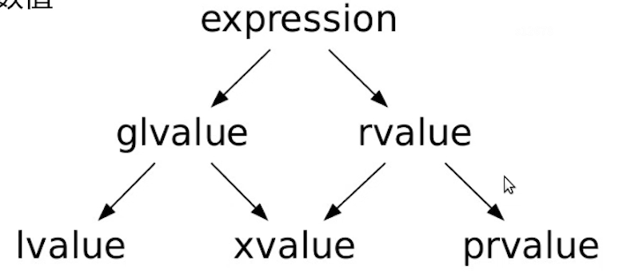
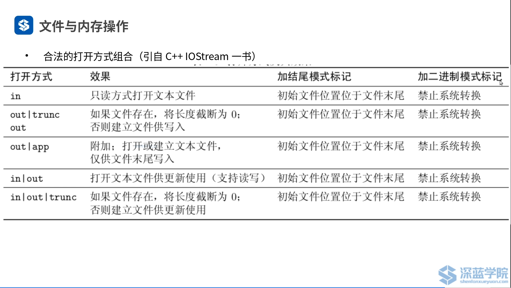
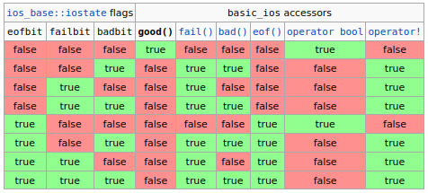
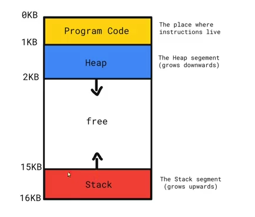
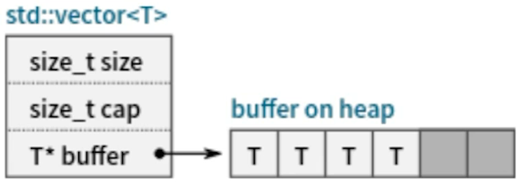
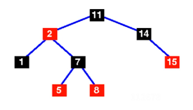
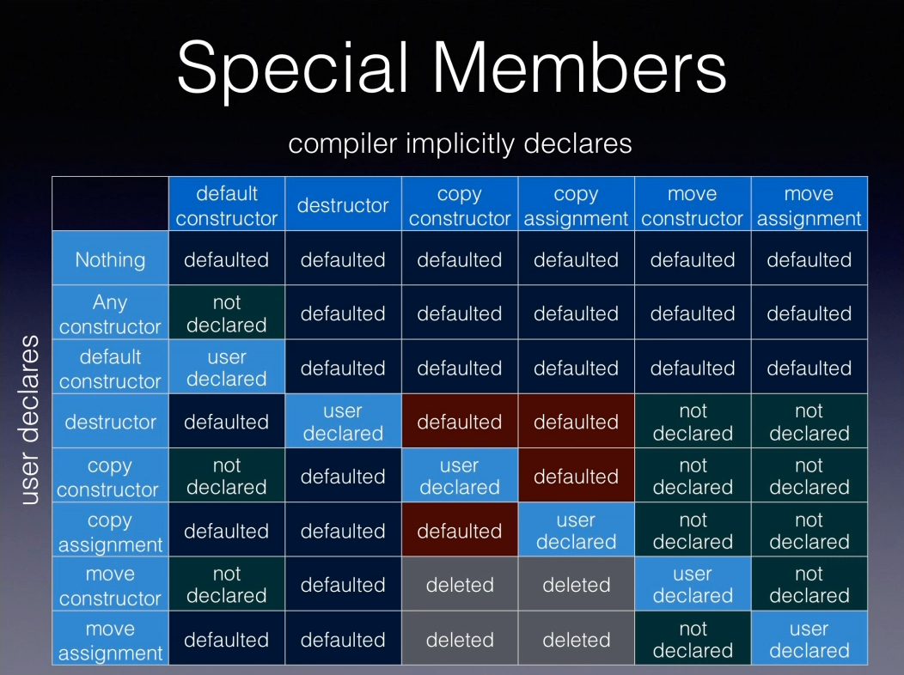
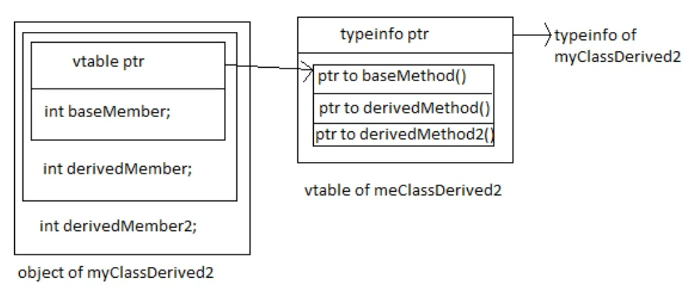

# c++

cppreference

compile explorer

cppinsight

调用串口：https://blog.csdn.net/sinat_16643223/article/details/117488099

## c++的编译/链接模型

1.预处理 将源文件转换为翻译单元的过程 #pragma once的使用

2.编译 将翻译单元转换为相应的汇编语言表示 编译优化 增量编译vs全部编译（源文件与目标文件的时间关系）

3.汇编

4.链接 合并多个目标文件，关联声明与定义

<>为系统中的文件，“”为自定义文件

编译选项通过--std=c++xx来改变编译器选择的c++版本。

## 对象与基本类型

```c++
#include <type_traits>
std::cout << std::is_same_v<decltype(x), decltype(y)> << std::endl;//可通过这种方式判断是否为相同类型
```

### 变量

字符类型：char（对应ASCII码，utf-8？），wchar_t，char16_t（c++11，unicode），char32_t（c++11，unicode）

整数类型：short，int，long，long long，数据大小未定义，在不同系统中可能不同，c++11引入固定尺寸的整数类型，如int32_t

unsigned int == unsigned

c++未指定char是否有符号，但可以使用signed char/unsigned char

字面值：20，024（8进制），0x14（16进制），1.3，1e3（double型），'\n'，’\x4d‘（16进制，ASCII码），“hello”（char[6]型），true（bool），nullptr（nullptr_t型）

可引入前后缀改变字面值属性，1.2f为float型，2ULL为unsigned long long型

自定义后缀：user-defined literal

```c++
#include <iostream>
//用户自定义类型
int operator "" _ddd(long double x)
{
    return (int)x * 2;
}

int main()
{
    int x = 3.14_ddd;
    std::cout << x << std::endl;
}
```

缺省初始化：int x;函数内（任意值）函数外（0）

直接/拷贝初始化：int x(10); int x{10}; int x = 10;

无符号数与有符号数进行比较会转化为无符号数，即(int)-1 > (unsigned int)3

c++20引入std::cmp用于以上情况的比较

### 指针与引用

c++11引入nullptr，是对象，为0，但不是整数类型，而是指针类型，数据类型为nullptr_t，设计函数重载时会有效果，类似于c中的NULL，但更加安全。

指针与bool隐式转换：空指针转换为false，非空指针转换为true

```c++
int* p = nullptr
```

void*指针：没有尺寸信息，可以保存任意地址，支持判等操作，但不支持加减操作。

指针 vs 对象：指针复制成本低，读写成本高

引用:引用是对象的别名，在构造时指定对象，生命周期内不能改变对象

```c++
int x = 3;
int& ref = x;
ref = ref + 1;//x也会增大
std::cout << x << std::endl;
```

### 常量类型与常量表达式

常量是编译期的概念，使用const声明，防止非法操作，优化程序逻辑。

```c++
const int x = 42;
int const x = 42;//这两行含义完全相同
int y;
int* const ptr = &y;//指针不能指向其他数据
const int* ptr = &y;//不能通过ptr来改变y的值，但ptr可以指向其他变量
const int* const ptr = &y//两个都不可改变
```

const出现在*左边即指针可指向其他数据，反而指向的数据不可改变。常量指针可以指向变量。

常量引用。主要用于形参，可读不可写。

常量表达式constexpr（c++11），声明编译器常量，编译器可以对它进行优化。

常量表达式指针

```c++
constexpr const int* ptr=nullptr;//ptr类型为const int* const
constexpr const char* ptr2="123";
```

### 类型别名

```c++
typedef int MyInt;
using MyInt = int;//c++11开始使用
typedef char MyCharArr[4];
using MyCharArr = char[4];//这两种表达含义相同

using IntPtr = int*;
int x = 3;
int* const ptr = &x;
const IntPtr ptr = &x;//这两种表达含义相同，IntPtr 作为一个整体，即指针，const用于修饰整个指针
```

另，不能通过类型别名定义引用的引用。

### 类型的自动推导

c++11引入变量类型的自动推导，通过初始化表达式推导数据类型，但仍为强类型。

```c++
auto x = 3.5 + 15l;//最常用的自动推导，但会导致类型退化
int x1 = 3;
int& ref = x1;
auto ref2 = ref;//类型退化的表现，ref2的类型为int型，而不是int&
auto& ref3 = ref;//auto&的引入就是为了产生引用类型，避免类型退化

const int x = 3;
auto& y = x;//这里y的类型为const int&，即不再发生类型退化
```

decltype(exp)：返回表达式的类型，可直接使用，且不会引发类型退化。

```c++
decltype(3.5 + 15l) x = 3.5 + 15l;

int x = 3;
int* ptr = &x;
decltype(*ptr) y;//类型为int&，即左值加引用 

int x;
decltype((x)) y;//变量类型为int&
decltype(x) y;//变量类型为int
```

decltype()中如果是表达式，则左值加引用，右值类型，如果是变量，则返回变量的类型，不再加引用。

c++14引入decltype(auto)，用于简化decltype的使用，不会引入退化，同时比较简洁。

c++20引入concept auto，表示一系列类型，目前编译器的支持较差。

```c++
#include <concept>
std::integral auto x = 3;//自动进行类型推导，但推导范围进行限制。
```

### 域与对象的生命周期

全局域：程序最外围的域，其中定义的是全局对象。全局对象的生命周期是整个程序的运行期间。

块域：使用大括号限定的域，其中定义的是局部对象。局部对象的生命周期起源域对象的初始化位置，终止与所在域被执行完成。

域还可以进行嵌套，系统优先选择局部域中的对象，隐藏全局域的对象

## 数组、vector与字符串

### 数组

```c++
int a;//a的类型为int
int b[10];//b的类型为int[10]
```

数组的长度不可以是变量。

```c++
int b[10];//值不确定
int b[10] = {};//全0
int b[] = {0, 1, 2};//自动推导数组的长度
```

不能使用auto来声明数组类型

数组不能进行复制

字符串数组具有特殊性

指针数组的定义与数组指针的定义

```c++
int* a[3];//指针数组，a是数组，指向3个指针
int (*a)[3];//数组指针，a是指针，指向数组
int (&a)[3];//数组的引用，但c++不允许引用数组
```

数组到指针的隐式转换

不能使用extern 指针隐式声明数组，通过extern int array[]方式进行声明

获得数组开头/结尾的指针std::begin/std::cbegin/std::end/std::cend

```c++
std::cout << std::begin(a) << ' ' << std::end(a) << std::endl;
```

这里的end指针是最后一个元素再后一个的指针。std::cbegin(a)，std::cend(a)获得const int*类型，避免对数组内容的写。另，这两个函数输入只能是数组，不可以是指针类型。同理，对extern声明的数组也不可以进行操作。

其他操作

```c++
int a[3];
std::cout << sizeof(a) / sizeof(int) << std::endl;//c语言库，通过sizeof获得数组的长度
std::cout << std::size(a) << std::endl;//c++标准库函数
std::cout << std::cend(a) - std::cbegin(a) << std::endl;

auto ptr = std::cbegin(a);//数组的遍历
while(ptr != std::cend(a))
{
    std::cout << *ptr << std::endl;
    ptr = ptr + 1;
}

for (int x : a)//c++11引入，基于range for的数组遍历
{
    std::cout << x << std::endl;
}
```

多维数组初始化只能省略第一个维度的值。

多维数组遍历

```c++
int x2[3][4] = {1, 2, 3, 4, 5};
for (auto& p : x2)//这里如果不用引用，由于类型退化，p会成为指针类型，无法进行下一步的遍历。只有最高维可以不用引用。
{
    for (auto q : p)
    {
        std::cout << q << std::endl;
    }
}
```

使用类型别名进行多维数组以及数组指针的定义

```c++
using A = int[4];

int main()
{
	A x2[3];
    int x2[3][4];//这两种定义方式相同
    A* ptr = x2;
}
```

### vector

```c++
#include <vector>
```

与内建数组相比，更侧重与易用性，可复制，可在运行期改变元素个数。

```c++
std::vector<int> x(3, 1);//初始化为3个元素，每个元素都为1
std::cout << x.size() << std::endl;//容器大小
std::cout << x.empty() << std::endl;//容器是否为空
x.push_back(2);//添加元素
x.pop_back();//移除最后一个元素
```

元素的索引

```c++
std::vector<int> x = {1, 2, 3};
std::cout << x.at(0) << std::endl;//包括越界判断，编译越界报错

auto b = std::begin(x);
auto b = x.begin();//这两种表达相同，但这里b不是指针，而是迭代器
auto e = x.end();
while(b != x.end())
{
    std::cout << *b << std::endl;
    b = b + 1;
}
for(auto p : x)
{
    std::cout << p << std::endl;
}
```

对容器的改变可能会导致迭代器实效。

```c++
std::vector<int> x;
std::vector<int>* ptr = &x;
std::cout << ptr-> size() << std::endl;//指针调用方法
```

### string

```c++
#include <string>
int main()
{
    std::string x = "hello,world";
    std::string y = x;
    y = y + '!';
    y = std::string("hello") + "world" + "!";//两个字符串数组不能拼接，其中一个是string即可拼接
    std::cout << y << std::endl;
    auto ptr = y.c_ptr();//返回c类型的指针，指向带'\0'的字符串
}
```

## 表达式

### 左值与右值

左值与右值是针对表达式的，而不是针对对象的。左值不一定放在=左边，右值也可能放在=左边

泛左值（glvalue）：确定一块内存空间的表达式

纯右值（prvalue）：某个运算符的操作数的值/void表达式（没有结果对象）/初始化对象，例如用new创建的对象。

亡值（xvalue）：其资源可以被重新使用

左值（lvalue）：非亡值的泛左值

右值（rvalue）：非泛左值的表达式



```c++
const int x = 3;//左值，但不能放在=左边
int y = int();
```

左值与右值的转换

```c++
int x = 3;
int y = x;//左值可以转化为右值

void fun(const int& par)//这里是一个引用，对应原本的内存位置，这里将3这个纯右值转换成了一个将亡值，是临时具体化的体现
{
}
int main()
{
    fun(3);
}
```

再论decltype：decltype表达式类型

亡值返回：T&&

左值返回：T&

纯右值返回：T

```c++
int main()
{
    int x;
    decltype(3) y;//int y;
    decltype(x) z = 3;//int& z;
    decltype(std::move(x)) w = std::move(x);//int&& w = std::move(x);
}
```

### 类型转换

一些操作符要求其操作数具有特定的类型或相同的类型，因此会引入类型转换。

隐式类型转换：自动发生，数据转换体现为整形提升和浮点提升，小类型的纯右值可转换为大类型的纯右值。数值转换不同于提升，由于存储方式的不同，会导致数值与精度的变化。

显式类型转换：

```c++
static_cast<double>(3) + 0.5;//static_cast在编译期进行转换，与之相对的是dynamic_cast
//static_cast不能将常量性的数据进行转化，与之相对的是const_cast
int x = 3;
const int& ref = x;
int& ref2 = static_cast<int&>(ref);
ref = 4;//x的值也发生了改变，const_cast的使用是非常危险的
//reinterpret_cast用另一种方式强行解释当前这一段空间，主要用来进行指针的类型进行转换
int x = 3;
int* ptr = &x;
double* ptr2 = reinterpret_cast<double*> ptr;
//c形式的类型转换依然可用，在cppreference中为explicit_cast，执行过程中为使用以上的某一种进行转换，主要在c语言中进行使用，c++不建议使用这种类型转换
```

### 操作符

操作符优先级：cppreference:operator precedence

#### 算数操作符

操作数一般都是右值，但加减法与一元+可以接受指针

一元操作符：+，-

二元操作符：+，-，*，/，%

```c++
7 * + 3;//是合法的
short x = 3;
auto y = +x;//y的类型会变化成int，由于一元操作符导致了整形提升
//关于除法：m / n * n + m % n == m，除的结果向0取整，余数的符号与被除数相同
```

#### 逻辑与关系操作符

关系运算符接收算数以及指针类型的操作数，逻辑操作符接收bool类型的操作数。一般非0的整数转化为True，否则转化为False。操作数与结果类型均为右值。

c++17及以前使用的关系操作符：<；<=；>；>=；==；!=；

关系运算符不可以串联。

逻辑操作符：&&；||；！；（与或非，逻辑与的优先级高于逻辑或）

只有非操作符是右结合的，其余均为左结合的。

逻辑操作符具有短路特性，当执行一部分就可以得到结果，后续的部分便不会求值。

```c++
if(a == true);//不要使用这种表达形式，这里会把true转化成1
if(a);//可以使用这种表达形式
```

c++20引入<=>逻辑运算符spaceship operator，需#include <compare>

```c++
auto res = (a <=> b);//省去两次判断的计算过程。
if(res > 0);//a>b // res == std::strong_ordering::greater
else if(res < 0);//a<b // res == std::strong_ordering::less
else;
```

返回的值的类型是

std::strong_ordering：在等于时完全相等，可以互相替换 great less equal

std::weak_ordering：在等于时等价，但不一定相等 great less equivalent

std::partial_ordering：涉及到NaN情况时可以返回unordered，浮点数运算会返回这个变量类型。less great equal unorderd

例如对负数求根号就会出现NaN的情况，这个量与0做大于小于等于都返回false。

在纯数值计算时没有什么区别，但涉及到重载时运算符相等不一定完全相同。

#### 位操作符

接收右值，进行位运算，返回右值，可能会涉及整型提升，不会涉及短路特性。

按位取反：~，除取反外，其他运算符都是左结合的

按位与或：& |

按位异或：^

移位：<< >>一定情况下等效乘除2的幂，但速度更快。处理负数的右移时在符号位填1。右移可以保证符号，但左移不能保证符号，因此有符号与无符号变量的结果可能不相同。整型提升会影响符号位。 

#### 赋值操作符

左操作数是可以改变的左值，右操作数为右值，可以转换为左操作数的类型。

赋值操作符是右结合的。赋值操作符的结果为左操作数。

```c++
x = y = 3;
(x = 5) = 2;//这个语句相当于x=2
short x;
int y = 3;
x = 0x80000003;//产生收缩转换，相当于x = 3
x = { 0x80000003 };//直接报错，大括号不允许产生收缩转换
x = { 3 };//正常执行
x = { y };//直接报错
x^=y^=x^=y;//将xy进行交换，节省内存，但效率不高且难懂
```

#### 自增与自减运算符

```c++
a++;//后缀的运算符，返回a的原始值
++a;//前缀的运算符，返回a变化后的值
int x = 3;
y = x ++;//3
y = ++ x;//5
```

操作数为左值，前缀时返回左值，后缀时返回纯右值。

```c++
++++ x;//合理
(x++)++;//无法通过编译
```

自增运算符建议使用前缀形式。后缀形式要付出临时变量的成本。

#### 其他操作符

成员访问操作符：

.的左操作数为左值则返回左值，左操作数是右值则返回亡值（xvalue）。

->的左操作数为指针，返回的值为左值。

条件操作符：唯一的三元操作符。首先对第一个操作数求值，判断后对后两个操作数之一进行求值。后两个操作数的类型必须相同。

```c++
res = (score > 0) ? 1 : (score == 0) ? 0 : -1;//条件运算符为右结合，会先计算后边的条件操作符。
```

逗号操作符，求值结果为最右边的操作数，为左结合。

sizeof操作符，操作数可以为一个类型或者一个表达式，并不会进行求值，而是返回相应的尺寸。

域解析操作符::

函数调用操作符（）

索引操作符[]

抛出异常操作符throw

c++17对表达式的求值限定，对于以下表达式确保e1求值先于e2：

```
e1[e2]
e1.e2
e1.*e2
e1->*e2
e1<<e2
e2=e1/e2+=e1
```

## 语句

### 语句基础

表达式语句：表达式后加分号，对表达式求值后丢弃，可能产生副作用。

空语句：仅包含一个分号的语句，可能与循环一起工作。

复合语句：用大括号括起来的一系列语句，结尾无需加分号，形成独立的域。

顺序语句与非顺序语句

顺序语句从语义上按照先后顺序执行，实际的执行可能因编译器优化等原因产生变化，与硬件流水线紧密结合，执行效率较高。

非顺序语句在执行过程中引入跳转，从而产生复杂的变化，引入了分支预测机制，但分支预测错误可能导致执行性能降低。

最基本的非顺序语句：goto通过标签制定跳转到的位置

```c++
int main()
{
	int x = 3;
    if(x) goto label;
    x = x + 1;
label:
    return 0;
}
```

向前（程序执行方向，即向下）跳转不能越过对象初始化的语句，向后跳转可能会导致对象的销毁与重新初始化。

本质上对应了汇编语言中的跳转语句，但缺乏结构性的含义，容易造成逻辑混乱，除特殊情况外，应避免使用。

### 分支语句

if语句在 c++17语法转换为if constexpr（可选）形式。

```c++
constexpr int grade = 50;
if constexpr (grade <= 60);//在编译期会删掉不会用到的语句，简化执行期的逻辑。
else;
```

```c++
int x;
if (y = x * 3; y > 100)//c++17合理，y在if语句执行后销毁
{
    std::cout << y << std::endl;
}
```

switch语句在c++17也引入初始化语句。条件为整形或枚举类型。在switch语句中引入了case和default标签。case标签后使用常量表达式。

```c++
int x;
switch(std::cin >> x; x)//这种写法在c++17及以后开始支持
{
        
}
```

可用break跳出本次switch语句的执行。在case或default中定义对象要加大括号，否则会编译报错。

[[fallthrough]]属性，插入这个属性语句避免进行fallthrough报警告。

如果switch中的case特别多可能会涉及一些算法中的查找，引入更好的优化。

### 循环语句

while语句，在while语句的条件部分不包含额外的初始化语句。

do while 语句，语句后边要加分号。

for循环语句，for(初始化表达式; 条件; 迭代表达式)语句

初始化表达式可以同时声明多个变量，但有一些限制，不建议多使用。

```c++
int* p, q;//这里p的变量类型为指针，q的变量类型为int
```

基于范围的for循环，本质为语法糖，编译器内部转换为一般的for循环。

```c++
std::vector<int> arr{1, 2, 3, ,4, 5};
for (int v : arr)
    std::cout << v << std::endl;
```

转化方法详细描述：cppreference range for

只读元素时尽量使用常量引用的形式，会提升代码效率，需要进行写入时建议使用万能引用

```c++
for(autp&& v : arr);
```

break与continue语句均不能用于多重循环嵌套，多重循环可以考虑goto语句。

### 达夫设备

逻辑为switch内部套用循环

```c++
const int buffer_count = 10000;
std::vector<size_t> buffer(buffer_count);
size_t max_value;
auto ptr = buffer.begin();
size_t i = 0;
switch(buffer_count % 8)
    for(; i < (buffer_count + 7) / 8; ++i)//避免for循环的执行占用的时间多，同时避免了余下的一部分数据独立处理
    {[[fallthrough]];
        case 0 : max_value = (max_value > *ptr) ? max_value : *ptr; ++ptr; [[fallthrough]];
        case 7 : max_value = (max_value > *ptr) ? max_value : *ptr; ++ptr;[[fallthrough]];
        case 6 : max_value = (max_value > *ptr) ? max_value : *ptr; ++ptr;[[fallthrough]];
        case 5 : max_value = (max_value > *ptr) ? max_value : *ptr; ++ptr;[[fallthrough]];
        case 4 : max_value = (max_value > *ptr) ? max_value : *ptr; ++ptr;[[fallthrough]];
        case 3 : max_value = (max_value > *ptr) ? max_value : *ptr; ++ptr;[[fallthrough]];
        case 2 : max_value = (max_value > *ptr) ? max_value : *ptr; ++ptr;[[fallthrough]];
        case 1 : max_value = (max_value > *ptr) ? max_value : *ptr; ++ptr;
    }
std::cout << max_value << std::endl;
```

## 函数

### 函数基础

函数头：包含函数名称、形式参数、返回类型

函数体：为一个语句块，包含了具体的运算逻辑

声明与定义：声明只包含函数头，不包含函数体，可出现多次，通常置于头文件中。

栈帧结构：调用函数时变量存储在栈结构中。


与之相对的结构为堆。

拷贝过程的（强制）省略：c++17强制省略拷贝临时对象。

```c++
extern "C"
int Add(int x, int y)
{
    return x + y;
}
```

这个函数转化为了c的函数类型，在链接的时候函数形式会转化为c的形式，但不再支持函数的重载，用于外部的调用。

### 函数详解

#### 参数

函数在函数头的小括号中包含零到多个形参，使用零个形参可以使用void进行标记。

对于非模板函数来说，每个形参都必须有对应的类型，但如果函数体中不适用，可以没有这个形参的名称，形参的名称变化不会引入函数的不同版本。

实参到形参的拷贝求值顺序不确定。

```c++
fun(x++, x++);//这样的代码非常危险，可能会因为编译器的不同导致不同的结果
```

c++17强制省略临时对象的拷贝，c++17以前是否省略由编译器进行操作。

```c++
fun(Str{});//在这个函数调用中不会调用Str类的构造函数。
```

传值、传指、传引用。

传参数过程中可能会导致类型退化。采用引用可以避免类型退化。

```c++
void fun(int par[3])//这里的类型与int* par / int par[]的结果完全相同，尽量不要写数字，容易造成阅读者的误解。通过int (&par)[3]可以防止发生类型退化。
{

}
void fun(int par[3][4])//这里等同于int (*par)[4]，但后边的值不能发生改变。
{
    
}
int main()
{
    int a[3];
    fun(a);
    int b[3][4];
    fun(b);
}
```

##### 变长参数

方法一：initializer_list，传入参数的类型都要统一。具体成员与函数详见cppreference initializer_list

```c++
#include <initializer_list>

void fun(std::initializer_list<int> par)
{
    
}
int main()
{
    fun({1, 2, 3, 4, 5});
}
```

方法二：可变长度模板参数

方法三：使用省略号表示形式参数。在c语言中采用的是这种方式，例如printf，但c++不建议使用这种方式了。

##### 缺省参数

函数可以调用缺省实参。如果某个参数为缺省形参，那在它右侧的所有参数都必须具有缺省实参。

缺省实参在定义与声明中只能出现一次，重复出现会报错。多个声明也不能对同一个缺省实参进行多次赋值。但声明需要从右到左进行赋值。在不同的编译单元可以使用不同的缺省初始化。

```c++
void fun(int x, int y, int z = 3);
void fun(int x, int y = 2, int z);
void fun(int x = 1, int y, int z);
void fun(int x, int y, int z)
{
	std::cout << x << std::endl;
}
```

缺省实参为对象时，实参的缺省值会随对象值的变化而变化。

##### main函数的两个版本

```
int main(int argc, char* argv[])
```

argv包含argc+1个元素，数组末元素为空指针，前面的元素指向字符串。第一个参数为可执行程序的调用的方式。

#### 函数体

程序返回分为隐式返回和显式返回。隐式返回要求必须是void类型的函数。

main函数返回0表示程序运行正常。隐式返回即表示返回0值。

return可以返回初始化列表。

```c++
std::vector<int> fun()//这里使用vector没有问题，但使用initializer_list不要使用这种方式。
{
    return {1, 2, 3, 4, 5};
}
```

小心返回自动对象的引用或指针。

```c++
int& fun()
{
	int x = 3;//如果是static类型的变量就不会出现问题。
    return x;
}
int main()
{
    int& ptr = fun();//这样的代码可以通过编译，但不是能正常使用的代码。
}
```

返回值优化RVO

```c++
Str fun()
{
	Str x;
    return x;
}
int main()
{
    Str res = fun();
}
```

这样的代码会在res的内存位置直接进行变量x的各种操作，也不会涉及到对象的赋值，更不会调用赋值时涉及的构造函数，提升代码的执行效率。c++17开始强制进行针对临时对象的优化，非临时对象，即具名返回值不强制进行优化，可通过-fno-elide-constructors进行优化。

#### 返回类型

经典方法：位于函数头的前部

c++11引入：将返回类型放在函数头的后部

```c++
auto fun(int a, int b) -> int//c++11可通过编译，涉及到泛型编程会更加方便，类内置的变量类型使用也可以简化
{
    return a + b;
}
auto S::fun() -> MyInt//MyInt为类内置的变量类型
```

c++14引入返回类型自动推导。

```c++
auto fun(int a, int b)//c++14引入这种方式，可通过auto自动推导返回类型，但auto是在编译期进行替换
decltype(auto) fun(int a, int b)//这种方式也可以使用，类型推导则遵从decltype类型推导的规则
{
    return a + b;
}
auto fun(bool input)//这种表达形式无法通过编译，返回的类型无法确定。
{
    if(input)
        return 3;
    else
        return 1.5;
}
```

使用constexpr if构造“具有不同返回类型的函数”

```c++
constexpr bool value = true;
auto fun()//这种表达方式可以正常使用
{
    if constexpr (value)//constexpr不能删除
        return 1;
    else
        return 1.5;
}
```

c++17：返回类型与结构化绑定

```c++
struct Str
{
    int x;
    std::striing y;
}
Str fun()
[
    return Str{};
]
int main()
{
    auto [v1, v2] = fun();//只能在c++17及以后使用，可以使代码看起来更简单，v1v2的类型可以不同
    std::cout << v1 << " " << v2 << std::endl;
}
```

c++17：[[nodiscard]]属性

```c++
[[nodiscard]] int fun(int a, int b)//添加属性后表示函数的返回值很重要，不保留会报警告。
{
    return a + b;
}
int main()
{
    fun(2, 3);//这样的写法只会耗费运算资源而不会有效果
}
```

### 函数重载与重载解析

重载的函数的参数列表是不同的，不能通过不同的返回类型进行函数的重载。

函数重载与name mangling

nm xxx.o | c++filt -t//查看文件的接口

选择正确的函数版本的过程称为重载解析。

#### 名称查找

限定查找：域解析运算符指定的域中进行查找。

非限定查找会进行域的逐级查找——名称隐藏。查找时先在域内部进行查找，但只查询上边的函数，找不到再采用外边的函数调用。

实参依赖查找 Argument Dependent Lookup

```c++
namespace MyNS
{
    struct Str {};
    void g(Str x)
    {
        
    }
}
int main()
{
    MyNS::Str obj;
    f(obj);//可通过编译，实参调用名字空间时函数也进入名字空间进行查找，只对自定义类型生效。
}
```

#### 重载解析

cppreference overload resolution

在名称查找的基础上进一步选择合适的调用函数。

过滤不能被调用的函数。参数个数不对、无法将实参转化为形参、实参不满足形参的限制条件。

在剩余版本中查找与调用表达式最匹配的版本。匹配级别越低越好（有特殊的规则）

级别1：完美匹配 或 平凡转换（比如加const）

级别2：promotion（提升，例如int -> long） 或 promotion加平凡转换

级别3：标准转换（例如int -> double） 或 标准转换加平凡转换

级别4：自定义转换 或 自定义转换加平凡转换 或 自定义转换加标准转换

级别5：调用形参包含省略号的版本

函数包含多个形参时，所选函数的所有形参的匹配级别都要优于或等于其他函数。

### 其他

递归函数：在函数体中调用自身的函数，通常用于描述复杂的迭代过程。

#### 内联、constexpr、consteval

内联函数（in line）：对于结构及其简单的函数，调用函数时对栈的操作更加耗费性能，为了保留逻辑的封装与复用功能，引入内联函数。在同一个源文件中包含函数定义与调用时编译器可能直接进行替换以提升性能。内联可能会出现问题，因此编译器不会把所有函数都变为内联函数。引入inline关键词将函数转化为内联函数。

```c++
//将函数放在头文件中，或者在源文件本文件中才可以进行内联，inline关键词允许多次相同的编译内容并选择其中一个进行执行。内联函数不能在头文件中放声明，在源文件中放定义。
inline void fun()
{
    std::cout << "hello, world" << std::endl;
}
```

constexpr函数：c++11起。constexp用于定义编译期常量，可在编译期获得值。将constexpr用于函数中可以定义如下函数：

constexpr函数中不能调用std::cin等只能在运行期执行的内容。

```c++
constexpr int fun()//这个函数可以在编译期执行，也可以在运行期执行，执行时间取决于编译期的优化程度。
{
    return 3;
}
constexpr int fun(int x)//编译期执行
{
    return x + 1;
}
constexpr int x = fun();//编译常量表达式必须在编译期进行赋值，fun函数就必须具有constexpr属性
constexpr int y = fun(3);
int y;
std::cin >> y;
z = fun(y);//运行期执行
```

consteval函数：c++20起。表明函数只能在编译期进行求值，编译完成后没有对函数的调用能力。备注：-std=c++2a。consteval的输入参数也必须是编译期就可以确定的值。明确说明只能在编译期执行，提升系统的性能，并避免函数的误调用。由于在编译期进行执行，因此声明不可以，必须在源文件中可以得到定义。

#### 函数指针

函数类型与函数指针类型：

```c++
int fun(int x)//这个函数类型为int(int)，括号外表示返回类型，括号内表示参数类型
{
    return x + 1;
}
using K = int(int);//函数类型，可以在std::function中进行使用。
K fun;//函数的声明，等价于int fun(int);
int(int) fun;//不能通过这种方式声明一个函数。

K* funptr = nullptr;//函数指针
K* funptr = &fun;//函数指针
std::cout << (*funptr)(100) << std::endl;//对函数指针的使用
```

函数指针用于高阶函数，例如函数接收函数作为参数或者返回一个函数。

```c++
#include <iostream>
#include <vector>
#include <algorithm>

int inc(int x)
{
	return x + 1;
}

int main()
{
	std::vector<int> a{1, 2, 3, 4, 5};
	std::transform(a.begin(), a.end(), a.begin(), &inc);
	for (auto x : a)
	{
		std::cout << x << std::endl;
	}
}
```

transform函数将第一个指针到第二根指针的数据通过函数处理放到第三个指针开始的一段内存中。

```c++
int inc(int x)
{
	return x + 1;
}
auto fun = inc;//这里fun是函数指针类型，函数是不能进行复制的，经过复制会转化为函数指针类型。函数指针作为函数输入参数也是进行复制，会自动转化为函数指针。
```

函数指针与重载

```c++
void fun(int)
{

}
void fun(int, int)
{

}
auto x = fun;//这里不能通过编译。涉及重载无法指向某一个函数。
using K = void(int);
K fun;//这里可以通过编译。
```

函数指针作为函数返回值

```c++
int inc(int x)
{
    return x + 1;
}
int dec(int x)
{
    return x - 1;
}
auto fun(bool input)
{
    if (input)
        return inc;
    else
        return dec;
}
int main()
{
    std::cout << (*fun(true))(100) << std::endl;
}
```

小心most vexing parse，可在wikipedia查看内容，大概原因如下：

```c++
TimeKeeper time_keeper(Timer());//这种表达既可以理解为类的实例化，也可以理解为是函数的声明，具有歧义。
```

这种问题促成了在c++11中通过大括号进行类的初始化的表达形式。将两个中任意小括号变为大括号都可以只能理解为类的实例化。

## 深入IO

``` c++
#include <fstream>
std::ifstream x;//std::ifstream x = std::basic_ifstream<char>();
std::basic_ifstream<char, std::char_traits<char>> x;//这种表达形式与上一行完全相同
```

iostream采用流式IO而非记录IO，但可以在此基础上引入结构信息。

处理的两个主要问题：

表示形式的变化：使用格式化/解析在数据的内部表示与字符序列间转换

与外部设备的通信：针对不同的外部设备（终端、文件、内存）引入不同的处理逻辑

所涉及到的操作：格式化/解析、缓存、编码转换、传输

采用模板来封装字符特性，利用继承来封装设备特性，常用的类型实际上是类模板实例化的结果。

### 输入与输出

输入与输出分为格式化与非格式化两类。

```c++
#include <iostream>

int main()
{
	int x;
	std::cin >> x;//格式化
	std::cin.read(reinterpret_cast<char*>(&x), sizeof(x));//非格式化，读入的数据都是字符级别的数据，输出不会与输入相同
	std::cout << x << std::endl;
}
```

非格式化IO：不涉及数据表示形式的变化

​		常用输入函数：get / read / getline / gcount

​		常用输出函数：put / write

格式化IO：通过移位操作符来进行的输入与输出

​		c++通过操作符重载以支持内建数据类型的格式化IO

​		可以通过重载操作符以支持自定义类型的格式化IO

格式控制

​		可接收位掩码类型（showpos）、字符类型（fill）与取值相对随意（width）的格式化参数

​		注意width方法的特殊性：触发后被重置，再次使用需重新调用

```c++
#include <iostream>

int main()
{
	int x = 3;
	std::cout.setf(std::ios_base::showpos);//输出正数时带+
	std::cout.width(10);//让输出占多少个字符
	std::cout.fill('.');//把缺省位置的空格改变成参数的内容
	std::cout << x << std::endl;//输出内容：........+3
}
```

操纵符

```c++
#include <iostream>
#include <iomanip>

int main()
{
	int x = 3;
	std::cout << std::showpoint << std::setw(10) << std::setfill('.') << x << std::endl;
}
```

将格式化变得更简洁，引入iomanip头文件，涉及setw也要多次使用。

提取会放松对格式的限制。

提取c风格的字符串时小心字符越界。

```c++
char x[5];//使用string类型不需要担心这种问题
std::cin >> x;//这种代码要小心
std::cin >> std::setw(5) >> x;//可通过这种方式防止字符串的越界，这个形式可以存储4个字符。
std::cout << x << std::endl;
```

### 文件与内存操作

#### 文件操作

使用三个类模板：basic_ifstream / basic_ofstream / basic_fstream用于输入 / 输出 / 同时输入输出

文件流可以处于打开和关闭两种状态，打开的文件流不能再次打开

```c++
#include <iostream>
#include <fstream>

int main()
{
    std::ofstream outfile("my_file");
    outfile << "hello\n";
    outfile.close();
    std::ifstream infile("my_file");
    std::string x;
    infile >> x;
    infile.close();
    std::cout << x << std::endl;
}
```

is_open方法：检测数据流是否已经绑定到一个文件上。

open方法：打开一个文件并与当前数据流关联

close方法：关闭文件，解除关联，数据流的析构过程也会调用这个函数。

文件流的打开模式：数据流的构造函数还包含一个缺省的打开方式

每种文件流都有缺省的打开方式

| 标记名（std::ios_base::） | 作用                         |
| ------------------------- | ---------------------------- |
| in                        | 打开以供读取                 |
| out                       | 打开以供写入                 |
| ate                       | 表示起始位置位于文件末尾     |
| app                       | 附加文件，即总是向文件尾写入 |
| trunc                     | 截断文件，即删除文件中的内容 |
| binary                    | 二进制模式                   |

```c++
std::ifstream infile("my_file", std::ios_base::in);//完全等价与默认的打开方式
std::ifstream infile("my_file", std::ios_base::in | std::ios_base::ate);//打开方式可以进行组合，通过按位或的方式进行组合。
```

ate与app不相同，ate的写入位置是可以移动的，app的写入位置无法改变文件中间的内容。

trunc在打开文件时会将文件中的内容进行删除，然后再进行写入之类的操作。默认状态的out也涉及先截断为0再进行后续操作。

binary能禁止系统特定的转换。

要避免意义不明确的流的使用方式，如ifstream + out



#### 内存操作

内存流：basic_istringstream / basic_ostringstream / basic_stringstream

也接受打开方式：in / out / ate / app

```c++
#include <iostream>
#include <sstream>
#include <string>
#include <iomanip>

int main()
{
	std::ostringstream obj1;
	obj1 << 1234;
	obj1 << std::setw(10) << std::setfill('.') << 1;
	std::string res = obj1.str();
	std::cout << res << std::endl;

	std::istringstream obj2(res);
	int x;
	obj2 >> x;
	std::cout << x << std::endl;
    
    std::ostringstream buf("test", std::ios_base::ate);//这里的test是内存中的初始状态，并且内存流指向test后
}
```

使用str()方法获取底层所对应的字符串

​		小心避免使用str().c_str()的形式获取c风格的字符串

```c++
std::string res = buf.str();//str()函数返回的值是一个右值，使用完成后会被释放掉。
auto c_res = res.c_str();//这种表达方式是可以的
auto c_res = buf.str().c_str();//这种表达方式是不行的，返回的指针指向的位置被释放了，导致未定义操作
```

基于字符串流的字符串拼接优化操作。采用这种方式比std::string的加法操作效率更高。

### 流的状态、定位与同步

#### 流的状态

cppreference : iostate

​		failbit / badbit / eofbit / goodbit

检测流的状态

​		good() / bad() / eof() / fail()方法

```c++
#include <iostream>
#include <fstream>

int main()
{
	//badbit错误，不可恢复的流错误
	std::ofstream outFile;
	outFile << 10;
	//failbit，输入输出操作失败（格式化或提取错误）
	int x;
	std::cin >> x;//输入一个字符串就会引起failbit错误
	std::ofstream outFile2;
	outFile2.close();//也会导致
	//eofbit错误，关联的输入序列已抵达文件尾。
	int x;
	std::cin >> x;//在linux输入ctrl+D，在win中输入ctrl+z
    
    std::cout << std::cin.good() << std::cin.bad() << std::cin.fail() << std::cin.eof() << std::endl;
	std::cout << static_cast<bool>(std::cin) << std::endl;
}
```



fail和eof可能会被同时设置，但二者含义不同；转化成bool值时不考虑eofbit

通常来说，只要流处于某种错误状态时，插入/提取操作就不会生效。

复位流状态

​		clear：设置流的状态为特定的值，默认参数值为std::ios_state::goodbit

​		setstate：将某个状态附加到现有的流状态上

捕获流异常：exceptions方法，通过try catch来进行异常的捕获。

#### 流的定位

获取流位置

​		tellg() / tellp() 可以用于获取输入 / 输入流位置（pos_type类型，是一个整数）

​		两个方法可能会失败，此时返回pos_type(-1)

```c++
#include <iostream>
#include <sstream>
int main()
{
    std::ostringstream s;
    std::cout << s.tellp() << '\n';//0，指向要写入的位置
    s << 'h';
    std::cout << s.tellp() << '\n';//1
    s << "ello, world ";
    std::cout << s.tellp() << '\n';//13
    s << 3.14 << '\n';
    std::cout << s.tellp() << '\n' << s.str();//18
}
```

```c++
#include <iostream>
#include <string>
#include <sstream>
 
int main()
{
    std::string str = "Hello, world";
    std::istringstream in(str);
    std::string word;
    in >> word;//在接触到空格、回车等分隔符时进行分离
    std::cout << "After reading the word \"" << word
              << "\" tellg() returns " << in.tellg() << '\n';
    //After reading the word "Hello," tellg() returns 6，指向要读取的位置
}
```

设置流位置

​		seekg() / seekp() 可以用于设置输入 / 输出流的位置，在双向流中输入与输出分别在不同位置。

​		这两个函数分别有重载的版本：

​			设置绝对位置：传入pos_type进行设置

​			设置相对位置：通过偏移量（字符个数ios_base::beg）+流位置符号的方式设置

​				ios_base::beg//流的开始

​				ios_base::cur//当前位置

​				ios_base::end//流的末尾

```c++
obj.seekg(0);
obj.seekg(3, std::ios_base::cur);
```

输出流在进行输出时会进行覆盖而不是进行插入。

#### 流的同步

基于flush() / sync() / unitbuf的同步

​	flush()用于输出流同步，刷新缓冲区

```c++
std::cout << "hello, world!" << std::flush;//这两种表达相同
std:cout.flush();
std::cout << std::endl;//endl添加回车并进行缓冲区刷新
```

​	sync()用于输入流同步，其实现逻辑是编译器所定义的，可能会涉及同时输入输出时刷新以获取最新内容

​	输出流可以通过设置unitbuf来保证每次输出后自动同步，消息会立即反应到终端上，但会降低程序的性能。

```c++
std::cout << std::unitbuf;//这两种表达相同
std::cout.setf(std::unitbuf);
std::cout << std::nounitbuf//取消自动同步
```

​	std::cout默认不使用自动同步，std::cerr默认使用自动同步

基于绑定（tie）的同步。

​	流可以绑定到一个输入出上，这样在每次输入 / 输出前可以刷新输出流的缓冲区

​	例如：std::cin 绑定到了std::cout上

与c语言标准IO库的同步

​	缺省情况下，c++的输入输出操作会与c的输入输出函数同步，付出运行成本

​	可以通过std::ios::sync_with_stdio(false)关闭该同步。

## 动态内存管理

### 动态内存基础

#### 栈内存与堆内存

栈内存的特点：更好的局部性（缓存一次搬运一组数据，读写速度更快），自动释放。

堆内存的特点：运行期动态扩展，不显式释放则一直存在。



Heap对应位置为堆内存，Stack对应位置为栈内存。栈内存由编译器编译的结果进行销毁，堆内存需要显式调用释放函数。Program Code部分只能进行读，不能进行写。

在c++中通常使用new与delete进行堆内存中变量的构造与销毁。

```c++
int* y = new int(2);//y在栈内存里，但y指向的对象在堆内存里，new会返回堆内存中对应位置的指针。
delete y;//这里释放了y指向的位置的内存，而不是y的内存，y在栈上，不能进行释放。
```

对象的构造分为两部：分配内存与在所分配的内存上构造对象，对象的销毁与之类似。

备注：static类型的变量既不在栈上，也不在堆上

#### new的常见用法

构造单一对象 / 对象数组

```c++
int* y = new int[5];//完成对象数组的构造，可通过y[2]这种方式进行数据的调用
int* y = new int[5]{1, 2, 3, 4, 5};//c++11引入这种方式进行初始化。

delete y;//这种行为的结果是不确定的，编译环境的改变可能导致程序无法执行。
delete []y;//通过数组构造的堆内存中的对象需要进行数组形式的销毁。
```

nothrow new：内存中可能会无法进行构造，在涉及c接口的代码中不能进行抛出异常，引入这种表达形式

```c++
#include <new>
int* y = new (std::nothrow) int(2);//这种表达形式不会抛出异常，分配不成功时y将赋值为0，即空指针
if (y == nullptr)//可通过这种方式进行特殊情况的处理，但不通过nothrow表达的构造无法通过这种方式触发
{
    
}
```

placement new

例如vector分配了4个空间，现在只使用了2个，第三个在构造时已经完成了内存的开辟，只需要完成对象的构造即可。

```c++
char ch[sizeof(int)];
int* y = new(ch) int(100);//这种方式就是placement new，在new后边的括号中传入已经开辟的内存指针，要求对应的内存足够大，传入的地址可以在栈中，也可以在堆中。本示例中为栈内存。
```

new与auto（c++11引入）

```c++
int* y = new auto(3);
int* y = new auto;//这种表达是错误的，无法通过编译
```

new与对象对齐

```c++
struct alignas(256) Str{};//这里通过256进行对齐，地址的位置一定是256的整数倍
Str* y = new Str;
std::cout << y << std::endl;
```

对象对齐应用于缓存的使用，一定情况下可以提升代码效率。

#### delete的常见用法

​	销毁单一对象 / 销毁对象数组

```c++
int* ptr = new int[5];
delete []ptr;
```

​	placement delete：只进行对象的析构，不进行内存的释放

```c++
char ch[sizeof(int)];
int* ptr = new (ch) int(100);//对于内建类型不需要进行任何操作，销毁只存在与概念上

struct Str
{
    ~Str()
    {
        
    }
}
int main()
{
    Str* ptr = new(ch)Str();
    ptr->~Str();//通过这种方式进行析构函数的调用。
}
```

new与delete的注意事项

​	根据单一对象 / 数组进行对应方式的销毁。

```c++
int* ptr = new int[1];
delete ptr;//这种方式也是不行的，数组与单一对象就是要分开
```

​	delete nullptr

```c++
int* ptr = nullptr;
delete ptr;
delete []ptr;//这两种表达都不会报错，且不会进行任何操作
```

​	不能delete一个非new返回的内存

```c++
int x;
delete &x;//这种行为会导致程序崩溃
```

​		通过malloc生成的内存也不能通过delete进行释放，只能使用free

​		内存地址加减的结果也不能通过new进行delete

​	同一块内存不能delete多次，执行时会导致程序崩溃

```c++
delete x;
x = nullptr;//可通过这种方式来避免多次释放
```

不要轻易调整系统自身的new/delete行为。

### 智能指针

#### 为什么引入智能指针

new与delete的问题：内存所有权不清晰，容易产生不销毁、多销毁的情况

auto_ptr(c++17删除)

#### shared_ptr

基于引用计数的共享内存方案，保证会销毁且只会销毁一次

```c++
#include <memory>
#include <iostream>
int main()
{
    int* x(new int(3));//这里x的类型为int*
    std::shared_ptr<int> x(new int(3));//这里x的类型为shared_ptr
}
```

析构函数会释放内存。

```c++
std::shared_ptr<int> x(new int(3));//x在使用完成后并不会释放，等y也使用完再进行释放。
std::shared_ptr<int> y = x;//定义时引用计数加1，共享引用计数，计数归零才会释放掉内存。
```

成员函数use_count()可返回引用计数的值。

get()/reset()方法

```c++
std::shared_ptr<int> x(new int(3));
std::cout << *x << std::endl;//对智能指针解引用
std::cout << *(x.get()) << std::endl;//对指针解引用

fun(int*){};
fun(x);//这种表达不行
fun(x.get());//这种表达可以

x.reset(new int(4));//尝试释放内存，如果计数为0则释放，再关联新的指针。
x.reset();//释放掉内存，并传入空指针，不进行任何的关联
x.reset((int*)nullptr);//与上一行的含义完全相同
```

指定内存回收逻辑

```c++
std::shared_ptr<int> x(new int(3));
//delete x.get();//系统在析构时执行的是这种操作。

void fun(int* ptr)
{
    delete ptr;
    std::cout << "delete ptr" << std::endl;
}
int main()
{
    std::shared_ptr<int> x(new int(3), fun);//这种表达形式可以让shared_ptr按照自定义的方式进行内存释放。
}
```

std::make_shared

```c++
std::shared_ptr<int> x(new int(3));
auto y = std::make_shared<int>(3);//引入优化，引用计数与值距离更近，可能在同一片缓存中提升性能
```

对对象数组的支持，c++17引入shared_ptr<T[]>，c++20引入make_shared使用数组

```c++
std::shared_ptr<int> x(new int[5]);//在释放时会出现问题，c++17以前要使用指定内存回收逻辑
std::shared_ptr<int[]> x(new int[5]);//c++17可以使用
auto x = std::make_shared<int[]>(5);//c++20开始使用，开启int[5]的空间
```

不要用delete指定销毁，会导致多次释放

```c++
std::shared_ptr<int> x(new int(3));
std::shared_ptr<int> y(x);//这种方式没问题
std::shared_ptr<int> y(x.get());//这种方式有问题，导致二次释放
```

#### unique_ptr

```c++
std::unique_ptr<int> x(new int(3));//这片内存由x独占，不能赋值给其他智能指针
std::unique_ptr<int> y = x;//这行代码会报错

std::unique_ptr<int> y = std::move(x);//不能进行赋值，但可以进行移动，这一行执行完成后x为nullptr，y指向原本x指向的位置

auto res = std::make_unique<int>(3);//这种方式是可以的

void fun(int* ptr)
{
    delete ptr;
}
std::unique_ptr<int, decltype(fun)>x(new int(3), fun);//删除器要用这种方式来表达
```

#### weak_ptr

防止循环引用而引入的智能指针

```c++
struct Str
{
	//std::shared_ptr<Str> m_nei;
    std::weak_ptr<Str> m_nei;
    ~Str()
    {
        std::cout << "balabala" << std::endl;
	}
}
int main()
{
    std::shared_ptr<Str> x(new Str{});
    std::shared_ptr<Str> y(new Str{});
    x->m_nei = y;//出现了循环的节点
    y->m_nei = x;//以上的表达方式不会调用析构函数，也不会进行空间的释放
    
    if(auto ptr = x->m_nei.lock(); ptr)//上边的语句用括号括起来，完成对xy的释放就会进入NO
    {//lock方法会返回shared_ptr类型的指针，如果引用计数已经归零则会返回空指针
        std::cout << "YES" << std::endl;
    }
    else
    {
        std::cout << "NO" << std::endl;
    }
}
```

将结构体中的shared_ptr改成weak_ptr即可解决问题，weak_ptr在构造时不会增加shared_ptr的引用计数的值。

### 动态内存的相关问题

#### siezof

sizeof不会返回动态内存的大小。

```c++
int* ptr = new int[3];
std::cout << sizeof(ptr) << std::endl;//只会返回int*的大小，与开辟的内存大小无关。
```

vector同理，包含的变量数量并不会改变sizeof返回的值。

#### allocator

使用分配器（allocator）来分配内存

```c++
std::allocator<int> al;
int* ptr = al.allocate(3);//分配一块可以容纳三个int类型的内存并返回地址，不包含初始化（构造函数）
```

可以在allocator指定的内存上使用placement new来进行构造函数的调用。

c++20开始将allocate方法引入[[nodiscard]]属性，如果返回值没有被赋值则将出现警告

```c++
al.deallocate(ptr, 3);//释放一段内存
```

#### malloc/free

malloc与free函数只会进行内存的开辟与释放，而不包含构造函数与析构函数的调用。

#### aligned_alloc

malloc不能分配对齐的内存，因此引入aligned_alloc函数，输入参数额外包含对齐信息。

#### 动态内存与异常安全

```c++
int* ptr = new int(3);
//...在这一段代码中出现异常，调到异常捕获位置
delete ptr;

std::shared_ptr<int> ptr(new int(3));//这种表达可以保证异常的安全性
```

#### 垃圾回收

cppreference:dynamic memory manange:garbage collector support(并不实用，c++23移除)

c++希望对对象的生命周期进行准确的控制，垃圾回收机制耗费计算资源，不建议使用。

## 容器

容器：一种特殊的类型，其对象可以放置其他类型的对象

需要支持的操作：对象的添加、删除、索引、遍历

有多种算法可以实现容器，每种算法各有利弊

迭代器：用于指定容器中的一段区间，以执行遍历、删除等操作。

获取迭代器：(c)begin/(c)end，(c)rbegin/(c)rend，r表示从后往前，翻转的前后

迭代器分为5类，不同的类别支持的操作集合不同。

```c++
std::vector<int> x{1, 2, 3};//vector就是容器
auto b = x.begin();
auto e = x.end();
```

### 序列容器

对象有序排列，使用整数值进行索引。c++标准库中提供了多种序列容器模板。

不同的容器所提供的的接口大致相同，但根据容器性质的差异，其内部实现与复杂度不同。

对于复杂度过高的操作，提供较难使用的接口或不提供相应的接口。

#### array

元素个数固定的序列容器，内部维护了一个内建数组，与内建数组相比提供了复制的操作。c++11引入。

```c++
#include <array>
std::array<int, 3> a;//array具有固定的长度，需要在编译期给出数组的长度，初始化与数组类似
std::array<int, 3> b = a;
```

成员类型：value_type、size_type等

元素访问：[]、at、第一个元素front、最后一个元素back、data返回指针指向数组中的第一个元素

容量相关（平凡实现）：empty、size、max_size，为了统一接口实现了这些设计

填充与交换：fill、swap交换两个array

比较操作：<=>（c++20只保留该运算符）比较只能在完全相同类型的array进行比较

迭代器与vector类似

#### vector

元素连续存储的序列容器，元素的数量可以发生改变的容器



提供的接口与array类似，但有其特殊性

容量相关接口：capacity / reserve预设buffer空间 / shrink_to_fit缩减到size的大小

附加元素接口：push_back / emplace_back减少一次拷贝，某些情况效率更高

元素插入接口：insert(迭代器, 值) / emplace

元素删除接口：pop_back / erase(迭代器) / clear删除全部元素

vector不支持push_back / pop_front，可以用insert / erase模拟，但效率很低

swap操作效率很高，使用方法：a.swap(b)

写操作可能会导致迭代器失效

#### forward_list/list

基于链表/双向链表的容器

与vector相比，list插入删除成本较低，但随机访问成本较高

提供了pop_front / splice(把一个list的内容一次性接入另一个list)等接口

写操作通常不会改变迭代器的有效性

forward_list单向链表：成本更低的链表

​	迭代器只支持递增操作，没有rbegin/rend接口

​	不支持size方法

​	不支持pop_back / push_back

​	XXX_after操作：在某个节点后进行插入/删除/splice等操作

#### deque

vector与list的折中

push_back / push_front速度较快

在序列中间插入、删除速度很慢

#### basic_string

提供了对字符串专门的支持

std::string = std::basic_string<char>

提供了find，substr等字符串特有的接口

提供了数值与字符串转换的接口：to_string(c++11)、stoi(c++11)

针对短字符串的优化：short string optimization(SSO)

### 关联容器

对象顺序并不重要，使用键进行索引。

set/map/multiset/multimap采用红黑树进行索引

#### set



```c++
#include <set>
std::set<int> x{1, 4, 100, 56};//set为集合，顺序不重要，且不会有重复元素
```

通常来说，元素需要支持<比较大小，或引入自定义的比较函数来引入大小关系

```c++
struct Str
{
    int x;
};
bool MyComp(const Str& val1, const Str& val2)
{
    return val1.x < val2.x;
}
int main()
{
    std::set<Str, decltype(&MyComp)> s({Str{3}, Str{5}}, MyComp);//可通过这种方式引入比较函数
}
```

遍历时会按照由小到大的顺序进行打印（树的中序遍历）

插入元素：insert / emplace避免不必要的拷贝 / emplace_hint带提示（迭代器）的插入

删除元素：erase传入值、迭代器都可以实现

访问元素：find返回迭代器，如果没有则返回end迭代器 / contains(c++20)返回bool值，是否包含

修改元素：extract（c++17）

set的迭代器指向的数据是const的，不能通过迭代器进行元素的修改

#### map

数中的每个结点是一个std::pair，键值需要支持用<比较大小，或者采用自定义比较函数进行比较

也可以通过for(auto p : m)的方式进行遍历，也可以通过for(auto& [k, v] : m)进行遍历。

map迭代器指向的对象是std::pair，其键值是const类型

删除元素：erase（迭代器/键值）

访问元素：find/contains/at/[]后两种方式通过键值获取值，[]搜索存在的键值会构造新的对象。

[]不能对const map进行操作。

#### multiset/multimap

与set/map类似，但允许重复键

find返回首个查找到的元素（按照递增顺序）

count返回元素的个数

lower_bound / upper_bound / equal_range返回查找到的区间

```c++
auto b = s.lower_bound(1);
auto e = s.upper_bound(1);
for(auto ptr = b; ptr != e; ptr++)
{
    std::cout << *ptr << std::endl;
}

auto p = s.equal_range(1);//与以上代码的结果相同
for(auto ptr = p.first; ptr != p.second; ptr++)
{
    std::cout << *ptr << std::endl;
}
```

#### unordered容器

unordered_set/unordered_map/unordered_multiset/unordered_multimap(全部c++11)

通过哈希表实现无序的容器

与set/map相比查找性能更好，但插入操作一些情况下会慢

键值需要支持两个操作：转换为hash值；判等

不支持大多数容器级的关系运算，仅支持==和！=，但速度较慢

自定义hash与判等函数

```c++
struct Str
{
    int x;
};
size_t MyHash(const Str& val)
{
	return val.x;
}
bool MyEqual(const Str& val1, const Str& val2)
{
	return val1.x == val2.x;
}
int main()
{
	std::unordered_set<Str, decltype(&MyHash), decltype(&MyEqual)> x(1, MyHash, MyEqual);
}
```

### 适配器与生成器

适配器：调整原有容器的行为，使得其对外展现出新的类型、接口或返回新的元素

生成器：构造元素序列

#### 类型适配器

basic_string_view(c++17)

​	可以基于std::string，c字符串，迭代器构造，将两种字符串形式进行了统一

​	提供成本较低的接口操作，包含首尾的迭代器信息

​	不可进行写操作

​	原字符串被释放后不可使用

```c++
#include <iostream>
#include <string>
#include <string_view>

bool fun(std::string_view str)//string_view是一个非常便宜的数据类型，占据16个字节，不需要引用
{
	if(!str.empty())
	{
		std::cout << str[0] << std::endl;
	}
}

int main()
{
	fun("123");
	fun(std::string("123"));//既支持c字符串，也支持c++字符串
    std::string s = "123";
    fun(std::string_view(s.begin(), s.begin() + 3);//迭代器构造
}
```

span(c++20)

可基于c数组、array等构造

可读写

```c++
#include  <span>
void  fun(std::span input)
{
    for(auto p : input)
    {
        std::cout  << p << std::endl;
    }
}
int main()
{
    int a[3] = {1, 2, 3};
    fun(a);
    std::vector<int> b = {1, 2, 3};
    fun(b);
}
```

#### 接口适配器

对底层序列容器进行封装，对外展现栈、队列与优先级队列的接口

stack提供push、pop、top操作

queue提供push、pop、front、back操作

priority_queue要求元素支持比较操作，获取元素时直接获取优先级最高的元素

#### 数值适配器adapter(c++20)

cppreference::ranges library

std::range::XXX_view/std::views::XXX

可以将一个输入区间的的值变换后输出

数值适配器可以组合，引入复杂的数值适配逻辑

```c++
#include <range>
bool isEven(int i)
{
    return i % 2 == 0;
}
std::vector v{1, 2, 3, 4, 5};
auto x = std::views::filter(isEven);
for(auto p : v | x)
for(auto p : x(v))//这两行相同
{
    std::cout << p << std::endl;
}
```

#### 生成器（c++20）

std::ranges::iota_view，std::views::iota

可以在运行期生成无限长或有限长的数值序列

```c++
for(int i : std::ranges::iota_view{1, 10});
for(int i : std::views::iota(1, 10));
for(int i : std::views::iota(1) | std::views::take(9));//这三种表达相同，都是i从1到9
```

## 泛型算法&lambda

### 泛型算法

泛型算法：可以支持多种类型的算法：

```c++
#include <algorithm>
#include <numeric>
#include <ranges>//c++20
#include <vector>

int main()
{
	int x[100];
	std::vector<int> y[100];
	std::sort(std::begin(x), std::end(x));
	std::sort(std::begin(y), std::end(y));
}
```

如何实现支持多种类型：使用迭代器作为算法与数据的桥梁

泛型算法通常来说都不复杂，但优化足够好

一些泛型算法与方法同名，实现功能类似，此时建议调用方法而非算法，泛型为了支持多种类型会导致一定的性能损失。

例如：std::find VS std::map::find

#### 读算法

cppreference::accumulate / find / count

#### 写算法

cppreference::fill / fill_n

读+写：transform / copy

注意：写算法一定要保证目标区间足够大

#### 排序算法

sort / unique基于连续的容器，删除重复的数据，返回迭代器指向独特元素的下一个元素

#### 常见迭代器

泛型算法使用迭代器实现元素访问

输入迭代器：可读、可递增，典型应用为find算法

输出迭代器：可写、可递增，典型应用为copy算法

前向迭代器：可读写、可递增，典型应用为replace算法

双向迭代器：可读写、可递增递减，典型应用为reverse算法

随机访问迭代器：可读写、可增减一个整数，典型应用为sort算法

一些算法会根据迭代器类型的不同引入相应的优化：如distance算法

#### 特殊迭代器

插入迭代器：back_insert_iterator调用push_back / front_insert_iterator调用push_front / insert_operator提供容器+容器迭代器，调用insert

```c++
#include <iostream>
#include <iterator>
#include <deque>
 
int main()
{
    std::deque<int> q;
    std::back_insert_iterator< std::deque<int> > it(q);//可以替代普通的迭代器用于避免内存越界
 
    for (int i=0; i<10; ++i)
        it = i; // calls q.push_back(i)
 
    for (auto& elem : q) std::cout << elem << ' ';
}
```

``` c++
std::vector<int> x;
std::fill_n(std::back_insertor(x), 10, 3);//这样写不会出现内存越界情况
```

流迭代器：istream_iterator / ostream_iterator

```c++
#include <sstream>
#include <iterator>
#include <iostream>

int main()
{
	std::istringstream str("11 2 3 4 5");//可用于累加之类的算法中
	std::istream_iterator<int> x(str);//从内存流中解析整形变量
    std::istream_iterator<int> y{};//用于表示区间结尾位置，用法参考end()，x到达末尾就会等于y
	std::cout << *x << std::endl;//11
	x ++;
	std::cout << *x << std::endl;//2
}

```

反向迭代器：rbegin rend从后向前进行遍历

移动迭代器：move_iterator：使用std::move进行赋值，完成后原容器为空

迭代器与哨兵（Sentinel）：标识区间结尾的位置，例如以上流迭代器中的y

#### 并发算法（c++17/c++20）

SIMD：一条指令处理多条数据

std::execution::seq(c++17)顺序执行，可通过以下的集中方式提升代码的效率

std::execution::par(c++17)并发执行（多线程执行）

std::execution::par_unseq(c++17)并发非顺序执行，使用SIMD

std::execution::unseq(c++20)单线程SIMD执行

### bind&lambda

很多算法允许通过可调用对象自定义计算逻辑的细节：transform, copy_if, sort

函数指针：概念直观，但定义位置受限

类：功能强大，但书写麻烦

bind表达式：基于已有的逻辑灵活适配，但描述复杂逻辑时语法可能会比较复杂难懂

lambda表达式：小巧灵活，功能强大

#### bind

通过绑定的方式修改可调用对象的调用方式。

std::bind1st、std::bind2nd：只有部分对象可以使用这些方法，c++11过时，c++17删除

```c++
std::vector<int> x{1, 2, 3, 4, 5, 6, 7, 8, 9};
std::vector<int> y;//将greater的第二个参数绑定为3
std::copy_if(x.begin, x,end(), std::back_inserter(y), std::bind2nd(std::greater<int>(), 3));
```

std::bind(c++11)

```c++
bool MyPredict(int val1, int val2)
{
    return val1 > val2;
}
std::vector<int> x{1, 2, 3, 4, 5, 6, 7, 8, 9};
std::vector<int> y;//_1为调用函数时的第一个参数
std::copy_if(x.begin, x,end(), std::back_inserter(y), std::bind(MyPredict, std::placeholders::_1, 3));
```

```c++
using namespace std::placeholders;
auto x = std::bind(MyPredict, _2, 3);
x("hello", 50);//将第二个参数传入，第一个无所谓

auto x = std::bind(MyPredict, _1, 3);
auto y = std::bind(MyPredict, 10, _2);
auto z = std::bind(MyAnd, x, y);//通过这种方式进行复杂逻辑的表达
std::cout << x(5);
```

调用std::bind时，传入的参数会被复制，这可能会产生一些调用风险，例如局部变量指针的调用

可以使用std::ref或std::cref（常量引用）避免复制的风险

```c++
void Proc(int& x)
{
    ++x;
}
int main()
{
    int x = 0;
    auto b = std::bind(Proc, x);
    b();
    std::cout << x << std::endl;//这里会打出0，x是通过拷贝的方式赋值的
    auto b = std::bind(Proc, std::ref(x));//这种方式可以真正修改x
    b();
    std::cout << x << std::endl;
}
```

std::bind_front(c++20)：std::bind的简化形式，绑定前一个参数

#### lambda（c++11）

为了更灵活地实现可调用对象而引入

​	c++11引入lambda表达式

​	c++14支持初始化捕获、泛型lambda

​	c++17引入constexpr lambda，*this捕获

​	c++20引入concepts，模板lambda

lambda表达式会被编译器翻译成类进行处理。可在cppinsights里面查看具体的实现。

基本组成部分：

​	参数与函数体

```c++
auto x = [](int val)
{
    return val > 3 && val < 10;
};
```

​	返回类型

```c++
auto x = [](int val) -> float//指定返回类型
{
    if(val > 3)
        return 3.0;
    else
        return 1.5f;
};
```

​	捕获：

​		针对函数体中使用的局部自动对象进行捕获

```c++
int y = 10;
auto x = [y](int val)
{
    return val > y;
};
```

​		值捕获、引用捕获与混合捕获

```c++
int y = 10;
auto x = [y](int val) mutable
auto x = [=](int val)//默认进行自动对象捕获
{
    ++y;
    return val > y;
};
std::cout << x(5) << std::endl;
std::cout << y << std::endl;//这里输出10，为值捕获
```

```c++
int y = 10;
auto x = [&y](int val)
auto x = [&](int val)//默认进行引用捕获
{
    ++y;
    return val > y;
};
std::cout << x(5) << std::endl;
std::cout << y << std::endl;//这里输出11，为引用捕获
```

```c++
int y = 10;
int z = 3;
auto x = [&y, z](int val)//混合捕获
{
    ++y;
    return val > z;
};
```

​		this捕获

```c++
struct Str
{
    auto fun()
    {
        int val = 3;
        auto lam = [val, this]()
        {
            return val > x;
        };
        return lam;
    }
    int x;
}
```

​		初始化捕获（c++14）

```c++
int x = 10;
auto lam = [y = x](int val)
{
    return val > y;
};
```

​		*this捕获（c++20）

```c++
struct Str
{
    auto fun()
    {
        int val = 3;
        auto lam = [val, *this]()//不捕获指针，而是捕获整个对象，这样不会出现对已释放指针的求值
        {
            return val > x;
        };
        return lam;
    }
    int x;
}
auto wrapper()
{
    Str s;
    return s.fun();
}
int main()
{
    auto lam = wrapper();
}
```

​	说明符

​		mutable ：在实现中删掉const，可以对变量进行赋值

​		constexpr(c++17) ：lambda表达式可以在编译期进行调用

​		consteval(c++20)：lambda表达式只能在编译期进行调用

​	模板形参（c++20）

```c++
auto lam = []<typename T>(T val)
{
    return val + 1;
};
```

#### 深入lambda

捕获时计算（c++14）

即调用函数表达式（IIFE）

```c++
const auto value = []<typename T>(T val)
{
    return val + 1;
}(3);//构造后立即执行，一般用于常量初始化
```

使用auto避免复制（c++14）

```c++
std::map<int, int> m{{2, 3}};
auto lam = [](const auto& p)//这两种表达相同，但类型复杂，可以使用auto
auto lam = [](const std::pair<const int, int>& p)
{
    return p.first + p.second;
}
```

Lifting(c++14)

```c++
auto fun(int val)
{
	return val + 1;
}
auto fun(double val)
{
	return val + 1;
}
int main()
{
    auto lam = [](auto x)
    {
        return fun(x);//根据传入参数的类型进行重载函数的选择
    };
}
```

递归调用（c++14）

```c++
	auto factorial = [](int n)
	{
		auto f_impl = [](int n, const auto& impl) -> int//这个int不能省略，省略无法自动推导类型
		{
			return n > 1 ? n * impl(n - 1, impl) : 1;
		};
		return f_impl(n, f_impl);//把lambda表达式作为参数传入lambda表达式
	};
	std::cout << factorial(5) << std::endl;
```

### ranges（c++20）

泛型算法的改进，可以使用容器而非迭代器作为输入

```c++
#include <iostream>
#include <algorithm>
#include <vector>
#include <ranges>

std::vector<int> x{1, 2, 3, 4, 5};
auto it = std::find(x.begin(), x.end(), 3);
auto it = std::ranges::find(x, 3);
std::cout << *it << std::endl;
```

std::ranges::dangling类型的迭代器，避免对悬挂指针的解引用。

引入映射概念，简化代码编写

```c++
std::map<int,  int> m{{2, 3}};
auto it = std::ranges::find(m, 3, &std::pair<const int, int>::second);//查找值为3的迭代器
std::cout << it -> first << it -> second << std::endl;
```

引入view，灵活组织程序逻辑

从类型上区分迭代器与哨兵

## 类与面向对象编程

### 结构体与对象聚合

结构体：对基本数据结构进行扩展，将多个对象放置在一起视为一个整体。

```c++
typedef struct Str
{
    int x;
    int y;
} MStr;
```

​	结构体的声明与定义（注意定义后面要以分号结束）

​	仅有声明的结构体是不完全类型

​	结构体（以及类）的一处定义原则：翻译单元级别，在不同文件中可以有重复

数据成员（数据域）的声明与初始化

​	（c++11）数据成员可以使用decltype来声明其类型，但不能使用auto

```c++
struct Str
{
    decltype(3) x;
};
```

​	数据成员声明时可以引入const、引用等限定

​	数据成员会在构造类对象时定义

​	（c++11）类内成员初始化

​	聚合初始化：从初始化列表到指派初始化器（c++20）

```c++
struct Str
{
    int x;
    int y;
};
Str m_str{3, 4};//与数组的初始化比较类似
Str m_str{.x = 3, .y = 4};//这种方式保证程序的执行正常
```

mutable限定符

```c++
struct Str
{
    mutable int x = 0;//可以改变常量类型中的某些元素
    int y = 1;
};
const Str m_str;
m_str.x = 3;
std::cout << m_str.x << std::endl;
```

静态数据成员：多个对象之间共享的对象成员。

​	c++98：类外定义，const成员的类内初始化

```c++
struct Str
{
    static int x;//声明，在结构体定义时不会分配内存
    int y;
};
int Str::x;//定义，分配内存
int main()
{
    Str m_str1, m_str2;
    m_str1.x = 100;
    std::cout << m_str2.x << std::endl;
}
```

```c++
struct Str
{
    const static int array_size = 100;//编译时进行替换，并不分配内存，也可以通过上边的方法分配内存
    int arr[array_size];
};
```

c++17：内联静态成员的初始化

```c++
struct Str
{
    inline const static int array_size = 100;//分配内存
    inline static auto x = 3;
    int arr[array_size];
};
```

可以使用auto推导类型

静态成员的访问Str::array_size域操作符、m_str.array_size

在类的内部声明相同类型的静态数据成员

```c++
struct Str
{
    static Str x;//这种情况不能使用inline
};
Str Str::x;
```

### 成员函数（方法）

可以在结构体中定义函数，作为其成员的一部分，对内操作数据成员，对外提供调用接口。

​	在结构体中将数据与相关的成员函数组合在一起形成类，是c++在c基础上引入的概念

​	关键字class

​	类可视为一种抽象数据类型，通过相应的接口（成员函数）进行交互

​	类本身形成域，称为类域

成员函数的声明与定义

​	类内定义（隐式内联）即函数体可以写在头文件中

​	类内声明+类外定义，类外定义的方式不能写在头文件中，不是默认内联，可以通过inline强行内联

​	类与编译期的两遍处理：第一遍处理数据和函数名，第二次处理函数的逻辑，可以把方法放在前面，把数据成员放在后面，可以使用

​	成员函数与尾随返回类型（trail returning type）(c++11)

```c++
class Str
{
	using MyRes = int;
	MyRes fun();
	int x;
};

//Str::MyRes Str::fun();
auto Str::fun() -> MyRes
{
	return x;
}
```

成员函数与this指针

​	this指针指向当前调用方法的对象

​	基于const的成员函数重载

```c++
void fun(int x) const//这个函数不能对类内的数据成员进行修改，定义const对象时调用的是这个函数
void fun(int x)//这两个函数可以进行重载
```

成员函数的名称查找与隐藏关系

​	函数内部（包括形参名称）隐藏外部名称

​	类内部名称隐藏类外部名称

​	使用this或域操作符引入依赖名称查找

静态成员函数：不传入this指针，不能调用非静态的数据成员，可通过 类名::函数名()的方式进行函数的调用

​	在静态成员函数中可以返回静态数据成员

```c++
struct Str
{
    static auto& instance()//单例模式相关的内容
    {
        //static std::vector<int> x;
        static Str x;//这种表达都是可以的
        return x;
    }
}
```

成员函数基于引用限定符的重载（c++11）

```c++
class some_type()
{
    void foo() & ;//左值的引用
    void foo() && ;//右值的引用
    void foo() const & ;//常量左值的引用
    void foo() const && ;//常量右值的引用（基本不会使用）
}
```

### 访问限定符与友元

使用public / private / protected来限定类成员访问的权限，protected涉及类的继承时会使用到

​	访问权限的引入使得可以对抽象数据类型进行封装

​	类与结构体在缺省状态下访问权限的区别：类缺省状态下是private，结构体缺省状态下是private

使用友元打破访问权限限制--关键词friend

```c++
int main();
class Str
{
	friend int main();//友元，打破封装，可以访问类中标记为private的成员
	inline static int x = 5;
};

int main()
{
	std::cout << Str::x << std::endl;
}
```

​	声明某个类或某个函数是当前类的友元--慎用！

​	在类内首次声明友元类或友元函数

```c++
class Str
{
	friend int main();//这一句视为函数的声明
	inline static int x = 5;
};

int main()
{
	std::cout << Str::x << std::endl;
}
```

​		注意使用限定名称引入友元并非友元类（友元函数）的声明

```c++
friend int ::main();//这不是一个函数的声明
```

```c++
int main();
class Str
{
	friend int ::main();//这句不视为函数的声明
	inline static int x = 5;
};

int main()
{
	std::cout << Str::x << std::endl;
}
```

​	友元函数的类内外定义与类内定义

```c++
void fun();//没有这里的声明是不可以的

class Str
{
	friend int main();
	inline static int x = 5;
	friend void fun()//类内定义友元函数
	{
		std::cout << Str::x << std::endl;
	}
};

int main()
{
	fun();
}
```

隐藏友元（hidden friend）:常规名称查找无法找到，可通过实参依赖查找进行函数的查找（见函数重载部分的说明）

​	好处：减轻编译期负担，防止误用

​	改变友元的缺省行为：在类外声明或定义函数

### 构造、析构与复制成员函数

构造函数：构造对象时调用的函数，名称与类名相同，无返回值，可以包含多个版本（重载），（c++11）代理构造函数

```c++
class Str
{
    public:
    Str() : Str(3)//代理构造函数
    {
        //先调用代理构造函数，再执行函数体内部的逻辑以完成整个对象构造的过程
    }
    Str(int input)
    {
        x = input;
    }
    private:
    int x;
}
```

初始化列表：区分成员的初始化和赋值

```c++
class Str
{
    public:
    Str(const std::string& val) : x(val), y(0)//这里是初始化而不是赋值，提升效率
    {
        std::cout << x << std::endl;
    }
    private:
    std::string x;
    int y;
}
```

​	通常情况下可以提升系统性能

​	一些情况下必须使用初始化列表（类内定义引用）

​	注意元素的初始化顺序与其声明顺序相关，与其初始化列表中的顺序无关

​	使用初始化列表覆盖类内成员初始化的行为

缺省构造函数：不需要提供实际参数就可以调用的构造函数

```c++
Str(int input = 3)//这个也叫缺省构造函数
{

}
```

如果类中没有提供任何构造函数，那么在条件允许的情况下（例如引用不能进行缺省初始化，就不能合成），编译器会合成一个缺省构造函数，合成的缺省构造函数会使用缺省初始化来初始化其数据成员

调用构造函数时避免most vexing parse

使用default关键字定义缺省构造函数(c++11)

```c++
Str() = default;//与内部合成的缺省构造函数逻辑是相同的
```

单一参数构造函数：可以视为一种类型转换，可通过在构造函数前添加explict关键字来避免这种隐式转换，但static_cast可以进行转换

```c++
class Str
{
public:
	Str(int x) : val(x)//初始化列表方式的构造函数
    //explict Str(int x) : val(x)这个形式是不可以隐式转换的
	{}
private:
	int val;
};

void fun(Str m)
{
}

int main()
{
	Str m = 3;
    fun(3);//也是可以执行的
}
```

拷贝构造函数：接收一个当前类对象的构造函数。

```c++
class Str
{
public:
	Str() = default;//缺省初始化构造函数
	Str(const Str& x) : val(x.val)//拷贝初始化构造函数
	{
	}
private:
	int val;
};

int main()
{
	Str m;
    Str m2 = m;//调用拷贝构造初始化
}
```

会在涉及拷贝初始化的场景被调用，比如参数传递，因此要考虑构造函数的形参类型，经典声明形式为const Str&形式。

如果未显式提供，那么编译器会自动合成一个，合成的版本会依次对每个数据成员调用拷贝构造。也可以使用default实现缺省构造函数。

```c++
Str() = default;
Str(const Str&) = default;
```

移动构造函数（c++11）：接收一个当前类右值引用对象的构造函数

```c++
std::string ori("abc");
std::string newStr = std::move(ori);//移动构造函数，执行后ori内不再有内容
```

```c++
	Str(Str&& x)//接收将亡值，为移动构造函数，这里不能声明为const
    	: val(x.val)
    	, a(std::move(x.a))
	{
	}
```

​	可以从输入对象中“偷窃”资源，只要确保传入对象处于合法状态即可。

​	当某些特殊成员函数（如拷贝构造）未定义时，编译器可以合成一个。类中的对象有移动构造函数则调用移动构造函数，否则调用拷贝构造函数。

​	通常声明为不可抛出异常的函数，可在函数后加noexcept表示不可抛出异常。

```c++
Str(Str&&) noexcept = default;//不会抛出异常的函数
```

​	注意右值引用对象用作表达式时是左值，在移动构造函数中形参为左值。如果要偷资源要在移动构造中调用std::move。

拷贝赋值与移动赋值函数（operator=）

```c++
	Str& operator = (const Str& x)//拷贝赋值函数，本质是对运算符的重载
	{
		std::cout << "copy assignment is called." << std::endl;
        val = x.val;
        a = x.a;
		return *this;
	}
```

​	注意赋值函数不能使用初始化列表。

​	通常来说返回当前类型的引用，从而可以支持a = b = c的形式。

​	注意处理给自身赋值的情况。避免写出m = std::move(m)的时候出现的一些问题，例如对象成员中包含指针类型，可以先执行if(&x == this)，直接返回this即可

​	在一些情况下编译器会自动合成。

析构函数：~加当前类型，无参数，无返回值，用于释放资源。内存回收实在调用完析构函数才进行。除非显式声明，否则编译器会自动合成一个，内部逻辑是平凡的，通常不能抛出异常。

```c++
~Str() noexcept = default;
```

通常来说，一个类：

如果需要定义析构函数，那么也需要定义拷贝构造与拷贝赋值函数。涉及堆内存与指针的内存释放时可能会出问题，要重新分配内存并拷贝内容而不是拷贝指针。

如果需要定义拷贝构造函数，那么也需要定义拷贝赋值函数。

如果需要定义拷贝构造（赋值）函数，那么也要考虑定义移动构造（赋值）函数。

default关键字：只对特殊成员函数有效。

delete关键字：对所有函数有效，表示函数无法被调用，避免在重载中出现的一些情况。

```c++
void fun(int) = delete;//如果调用fun(3)会直接报错
void fun(double a)
{
    std::cout << a << std::endl;
}
```

不要为移动构造（移动赋值）函数引入delete限定符

如果只需要拷贝行为，那么引入拷贝构造即可

如果不需要拷贝行为，那么将拷贝构造声明为delete函数即可

注意delete移动构造（移动赋值）对c++17的影响

```c++
void fun(Str x);
fun(Str{})//这里会调用移动初始化（c++11），c++17以后不会发生这件事
```



红色框表示支持但可能会废除的行为（目前c++20还没有废除）

### 字面值类、成员指针与bind交互

#### 字面值类

可以构造编译期常量的类型，其数据成员需要是字面值类型。

```c++
class Str
{
public:    
    constexpr int fun() const
    {
        return x + 1;
    }
private:
    int x = 3;
}
constexpr Str a;
```

提供constexpr和consteval构造函数（小心使用consteval）

只能有平凡的析构函数

提供constexpr和consteval的成员函数（小心使用consteval）

注意从c++14开始constexpr / consteval成员函数非const成员函数

#### 成员指针

```c++
class Str
{
    public:
    int x;
    void fun()
    {
        
    }
};

int Str::*ptr = &Str::x;//数据成员指针
auto *ptr = &Str::x;//与上边相同
void (Str::*ptr_fun)() = &Str::fun;//成员函数指针
auto ptr_fun = &Str::fun;//函数没有重载的情况下可以使用这种方式进行初始化
```

域操作符子表达式不能加小括号(否则A::x一定要有意义)

成员指针的使用方式：

```c++
Str obj;
obj.*ptr = 3;
(obj.*ptr_fun)();
Str *ptr_obj = & obj;
ptr.obj->*ptr = 3;
```

#### bind交互

```c++
#include <functional>//bind在这里
#include <iostream>
class Str
{
    public:
    int x;
    void fun(double x)
    {
        std::cout << x << std::endl;
    }
};
int main()
{
    auto ptr = &Str::fun;
    auto ptr2 = &Str::x;
    Str obj;
    auto x = std::bind(ptr, obj, 100.0);//使用bind+成员指针构造可调用对象，类的对象要作为第二个参数
    x();
    auto y = std::bind(ptr2, obj);
    std::cout << y() << std::endl;//使用这种方法也可以基于数据成员指针构造可调用对象
}
```

### 运算符重载

使用operator关键字引入重载函数

​	重载不能引入新的运算，不能改变运算的优先级与结合性，通常不改变运算的含义。

​	函数参数个数与运算操作数个数相同，至少一个为类类型

​	除operator()外其他运算符不能有缺省参数

​	可以选择实现为成员函数与非成员函数，通常来说，实现为成员函数会以*this作为第一个操作数（注意==与<=>的重载）

根据重载特性，可以将运算符进一步划分（cppreference::operator overloading）

​	可重载且必须实现为成员函数的运算符（=，[]，()，->，与转型运算符）

​	可重载且可实现为成员函数的运算符

​	可重载但不建议重载的运算符（&&, ||, 逗号运算符），c++17中规定了相应的求值顺序但没有方式实现短路逻辑

​	不可重载的运算符（?:运算符）

对称运算符通常定义为非成员函数以支持首个操作数的类型转换（成员函数只支持第一个为类的形式，如果是非成员函数会考虑先将非类的数据进行数据类型转换再做运算），非成员函数调用private的数据要使用友元的形式，可以使用类内定义友元函数的形式。

移位运算符一定要定义为非成员函数，因为其首个操作数类型为流类型

```c++
friend auto& operator << (std::ostream& ostr, Str input)//输入流的写法同理
{
    ostr << input.val;
    return ostr;
}
```

赋值运算符也可以接收一般参数

operator[]通常返回引用，因为通常定义为索引含义，用于修改

```c++
int& operator [] (int id)//变量返回引用用于值的修改
{
    return val;
}
int operator [] (int id) const//常量返回值用于读取
{
    return val;
}
```

自增自减运算符可以接收0或1个参数，0个参数代表前缀自增，1个int代表后缀自增，这个参数的值没有意义。

```c++
Str& operator ++()//通常返回当前类型的引用
{
    ++ val;
    return *this;
}

Str operator ++(int)//不返回引用
{
    Str tmp(*this);
    ++val;
    return tmp;//返回临时拷贝构造的对象
}
```

前缀自增的操作较为简单，无所谓的情况尽量使用前缀自增。

使用解引用运算符*与成员访问运算符->模拟指针行为（注意.运算符不能重载）

->的重载较为复杂，会解释为x.operator->()->val，如果->返回的类型不是指针类型那么就判断返回的对象是否有->操作，如果有则递归调用

```c++
class Str
{
public:
	Str (int* p)
		:ptr (p)
		{

		}
	int& operator* ()
	{
		return *ptr;
	}
    int operator* () const//常量对象不能返回引用以避免对值的修改
    {
        return *ptr;
    }
	Str* operator -> ()
	{
		return this;//返回一个指针
	}
	int val = 100;
private:
	int* ptr;
};

int main()
{
	int a;
	Str x(&a);
	std::cout << x->val << std::endl;//会解释为x.operator->()->val
}
```

使用函数调用运算符构造可调用对象，参数列表的数量是不定的，lambda表达式的底层实现就是这种形式

```c++
int operator () (int x)//类可以以函数的形式进行调用，也可以进行重载
{
    return x + 1;
}
```

类型转换运算符的重载，将对象转化为其他的类型，函数声明为operator type() const

```c++
class Str
{
public:
	Str(int x)
		: val(x)
	{}
	operator int() const//这里是可以转化为int类型的声明方式，通常加const（操作不会改变对象内的内容）
	{
		return val;
	}
private:
	int val;
};
int main()
{
	Str obj(100);
	int v = obj;
	std::cout << v << std::endl;
}
```

类型转换操作符与单参数构造函数一样，都引入了一种数据转换方式。

避免引入歧义与意料之外的行为

```c++
Str obj;
obj + 3;//将obj转化为int类型或将3转化为Str类型都可以进行运算，出现了歧义，编译器会报错

std::cin << 3;//编译器避免了std::cin的类型转换为bool类型再进行移位的操作，编译器报错
```

explicit关键字表明转换只能通过显式的转换而不能隐式转换，一些情况下可以避免歧义错误，通过static_cast进行类型的转换。

explicit bool的特殊性：不能进行隐式转换，但是在判断，例如if或者三元操作符，即明确的条件判断时可以直接使用（隐式转换）

c++20中对==与<=>的重载

​	通过==定义！=

​		c++20中只要定义了==会自动推导出！=，或者说在编译时会转化为!a==b的形式，但是不能反过来通过！=定义==

​		c++20可以将x == obj 转化为obj == x，也就是说只需要写一个==的重载即可实现两种判等

​	通过<=>定义多种比较逻辑，引入<=>操作符重载即可支持<=、>等操作符的使用

​	<=>操作符的重载操作支持隐式交换操作数

​	注意<=>可返回的类型：strong_ordering，week_ordering，partial_ordering

### 类继承

通过类的继承（派生）来引入"是一个"的关系

​	通常采用public继承

```c++
struct Base
{
    
};
struct Derive : public Base//public可以省略，缺省为public，但如果是class，缺省状态为private
{
    
};
```

​	继承部分不是类的声明，不能写struct Derive : public Base;形式的声明

​	使用基类的指针或引用可以指向（绑定）派生类对象

```c++
	Derive obj;
	obj.x = 5;
	Base& ref = obj;//基类的引用，可以使用基类的成员和方法，但不能调用派生类的成员和方法
	Base* ptr = &obj;//基类的指针，与引用相同
	std::cout << ref.x << std::endl;
```

​	静态类型 vs 动态类型：这里ref的静态类型为Base&，但动态类型可以在执行期进行改变，甚至更换另一个派生自Base的类指针也可以

​	protected限定符：派生类内部可访问，如果是private类型那么派生类内部也不可以访问

类的派生会形成嵌套域

​	派生类所在域位于基类内部，派生类中的名称会覆盖基类，可通过Base::val的方式进行对基类的数据成员的访问。

​	缺省状态下，在派生类中调用构造时会调用基类的构造函数，但有参数的构造函数无法调用，通过初始化列表进行手动调用基类的构造函数

```c++
Derive(int a)
	: Base(a)//这里不需要使用域操作符
	{
	
	}
```

#### 虚函数

：通过虚函数与引用（指针）实现动态绑定

​	使用virtual关键字引入，非静态、非构造函数可声明为虚函数，会引入vtable结构，关于dynamic_cast类型转换



```c++
struct Base
{
	virtual void baseMethod()
	{

	}
	int baseMember;
};

struct MyClassDerived : public Base
{
	virtual void derivedMethod()
	{

	}
	int derivedMember;
};

struct MyClassDerived2 : public MyClassDerived
{
	virtual void derivedMethod2()
	{

	}
	int derivedMember2;	
};

int main()
{
	MyClassDerived2 d;
	Base& b = d;
	Base* ptr = &d;

	MyClassDerived2& d2 = dynamic_cast<MyClassDerived2&> (b);//这里对应b的类型，也就是Base包含虚函数才能进行转换，转换的过程可以将基类引用转化为派生类的引用
	MyClassDerived2* ptr2 = dynamic_cast<MyClassDerived2*> (ptr);//dynamic_cast是在运行期进行的类型转换
}
```

虚函数在派生类中可以进行重写（override，不是重载），函数签名不变（参数、返回类型不变，或从基类指针/引用变成派生类的指针/引用），虚函数特性不变（在基类中只要是虚函数，在派生类重写的函数自动转化为虚函数）

```c++
struct Base
{
	virtual void fun()
	{
		std::cout << 0 << std::endl;
	}
}
struct Derive : Base
{
    void fun()
    {
        std::cout << 1 << std::endl;
    }
}
void proc(Base& b)//动态多态，通过动态类型实现运行期的多态
{
    b.fun();
}
int main()
{
    Derive d;
    d.fun();//打出0
    Base& b = d;
    b.fun();//也打出0，如果没有virtual关键字则打出1
    Base b2;
    proc(d);//打出1
    proc(b2);//打出0
}
```

可以引入纯虚函数，相应的构造抽象基类，抽象基类不能声明对象，但可以声明指针/声明

```c++
virtual void fun() = 0;//基类没有实现这个接口，在派生类中要给出实现
```

纯虚函数可以在类外给出定义，但不能改变抽象基类的本质，但可以在派生类中用域操作符显式调用，纯虚函数定义的应用场景极少

c++11引入override关键字，在不满足重写条件时给出报错信息

```c++
void fun() override//这种形式即可
```

由虚函数所引入的动态绑定属于运行期行为，与编译期行为有所区别

​	虚函数的缺省实参只会考虑静态类型

​	虚函数的调用成本高于非虚函数，final关键字告诉编译器后续会有在本类上进行派生的类，但不会对本函数进行重写，一定程度提升性能。

```c++
void fun() override final
```

​	如果所有函数都不会再重写，也就是本类不会再进行派生了，进行进一步的优化，则可以这样写

```c++
struct Derive final : Base
```

​	为什么要使用指针（或引用）来引入动态绑定，如果使用对象赋值，直接将派生类转换成基类的类型，则只会调用基类的方法而不会调用重写的版本

​	在构造函数中调用虚函数要小心，派生类的构造中调用基类的构造，在基类的构造过程中，调用的虚函数是基类的版本而不是派生类的版本，在派生类的构造中调用的虚函数是派生类的版本

​	派生类的析构函数会隐式调用基类的析构函数，先调用派生类的析构，再调用基类的析构

​	通常来说要将基类的析构函数声明为虚函数，这样派生类的指针转化为基类指针再释放时会正常调用派生类的析构函数。否则指针释放时调用析构是一个未定义行为，不确定会调用派生类+基类析构或是只有基类的析构。

​	c++11引入虚析构函数默认形式

```c++
virtual ~Base() = default;
```

在派生类中修改虚函数的访问权限：访问权限以派生类为准

#### 特殊成员函数

派生类缺省定义的缺省构造函数会隐式调用基类的缺省构造函数

派生类缺省定义的拷贝构造函数会隐式调用基类的拷贝构造函数

派生类缺省定义的赋值函数会隐式调用基类的赋值函数

派生类的析构函数会调用基类的析构函数

派生类的其他构造函数会调用基类的缺省构造函数（可通过初始化列表调用指定的构造函数）

所有的特殊成员函数在显式定义时都可能需要显式调用基类相关成员

构造与销毁顺序：基类的构造函数会先调用，之后才涉及派生类中数据成员的构造，派生类中的数据成员会先销毁，之后才涉及基类的析构函数调用

#### 其他

public与private继承

​	public继承：描述“是一个”的关系，public还是public，protected还是protected，在类内也都是可用的

​	private继承：描述"根据基类实现出"的关系，将基类中的public与protected都转化为private，会影响再派生时的行为，因为private在派生时不可见了

​	protected继承：几乎不会使用，将基类中的public与protected都转化为protected

using与继承

​	使用using改变基类成员的访问权限，也可以改变基类函数的访问权限，但无法改变构造函数的访问权限

​	条件：派生类可以访问该成员

```c++
struct Base
{
	protected:
	int z;
    void fun()
    {
        
    }
};
struct Derive : Base
{
    public:
    using Base::z;//这里将基类中的z的权限改为public
    using Base::fun;//涉及重载时，会把所有名字叫fun的函数都放进public
};
```

​	使用using继承基类的构造函数逻辑

​	using与部分重写：可以把protected的函数转换为public，但不影响虚函数的性质，重写依然有效，在基类中包含虚函数重载时可实现部分重写

继承与友元：友元关系无法继承，但基类的友元可以访问派生类中基类的相关成员。

通过基类指针实现在容器中保存不同类型对象

```c++
struct Base
{
    virtual double getValue() = 0;
    virtual ~Base() = default;
};
struct Derive1 : Base
{
    Derive1(int x)
        : val(x)
    {}
    virtual double getValue() override
    {
        return val;
    }
    int val;
}
struct Derive2 : Base
{
    Derive1(double x)
        : val(x)
    {}
    virtual double getValue() override
    {
        return val;
    }
    double val;
}
int main()
{
    std::vector<std::shared_ptr<Base>> vec;//通过这种方式存储不同类型的数据
    vec.emplace_back(new Derive1{1});
    vec.emplace_back(new Derive2{3.14});
}
```

多重继承与虚继承

```c++
struct Base
{
    int x;
}
struct Base1:virtual Base//虚继承，只保存Base的一个实例，避免了x的多重定义
{};
struct Base2:virtual Base
{};
struct Derive : public Base1, public Base2//多重继承
{};
int main()
{
    Derive d;
    d.x;
}
```

空基类优化与[[no_unique_address]]属性（c++20引入）

```c++
struct Base//没有数据成员的类占据的内存容量为1
{};
struct Derive
{
	int x;
	[[no_unique_address]] Base b;
}
int main()
{
	std::cout << sizeof(Derive) << std::endl;//这里会输出4，节省内存资源
}
```

## 模板

### 函数模板

使用template关键字引入模板

```c++
template <typename T>//这里typename可以替换为class，含义相同
void fun(T);//函数模板的声明
template <typename T>//<>内部为模板参数，T为形式参数，表明一种类型
void fun(T input)//函数模板的定义，这里T为模板形参，input为函数形参
{
	std::cout << input << std::endl;
}
int main()
{
    fun<int>(3);//函数模板的显式实例化
}
```

函数模板中包含两对参数：函数形参/实参；模板形参/实参

实例化会使得编译器产生相应的函数（函数模板并非函数，不能调用）

模板在编译器包含两个阶段：模板语法检查、模板实例化

模板必须在实例化时可见：翻译单元的一处定义原则，模板放在头文件中可以直接编译，类似于内联函数，但内联是为了在调用时进行展开，而函数模板不会涉及展开的问题，也可以将模板的fun函数定义为内联函数，这样就可以进行展开。

```c++
template <typename T>
inline void fun(T)//内联的函数模板
{
}
```

函数模板的重载

```c++
template <typename T1， typename T2>
void fun(T1 input1, T2 input2)//与上面的版本为重载关系
{}
template <typename T>
void fun(T* input1)//与上面的版本为重载关系
{}
```

#### 模板实参的类型推导

如果函数模板在实例化时没有显式指定模板实参，那么系统会尝试进行推导

```c++
template <typename T>
void fun(T input)
{
	std::cout << input << std::endl;
}
int main()
{
	fun(3);//隐式实例化
}
```

推导是基于函数实参（表达式）确定模板实参的过程，其基本原则与auto类型推导类似。

​	函数形参是左值引用/指针：忽略表达式类型中的引用，将表达式类型与函数形参模式匹配以确定模板实参

​	函数形参是万能引用：如果实参表达式是右值，那么模板形参被推导为去掉引用的基本类型；如果实参表达式是左值，那么模板形参被推导为左值引用，触发引用堆叠。

```c++
template <typename T>
void fun(T&& input)//这就是万能引用的表达形式
{
	std::cout << input << std::endl;
}
int main()
{
    fun(3);
    int x = 3;
    fun(x);//这里T推导为int&，函数变成int& &&，会转化为int&，这就是引用折叠
}
```

​	函数形参中没有引用：忽略表达式类型中的引用，忽略顶层const，数组、函数转换成相应的指针类型。

```c++
template <typename T>
void fun(T input)
{}
int main()
{
    int x = 3;
    const int& ref = x;
	fun(ref);//忽略引用和顶层const，模板形参为int类型
    const int* const ptr = &x;
    fun(ptr);//忽略顶层const，模板形参为const int*
    int y[3];
    fun(y);//这里将数组转化为指针，模板形参为int*
}
```

如果模板有两个形参但实例化时指定了一个，那么指定的是第一个形参类型，第二个类型进行自动推导

模板实参并非总能够推到得到：如果模板形参与函数形参无关，则无法推导，即使相关，也不一定能进行推导，推导成功也可能存在因歧义而无法使用，例如函数形参中含有多个T，且实例化时类型不同时，无法进行自动推导

在无法推导时，编译器会使用缺省模板实参，可以为任意位置的模板形参指定缺省模板实参，可以处理无法推导，但不能处理实参歧义

注意与函数缺省实参的区别：可以写成typename T = int, typename T2，但函数缺省不可以，缺省参数必须放在后面

```c++
template <typename T = int>//缺省模板实参，在无法自动推导的情况下则使用缺省的模板实参
void fun(T input)
{}
```

可以显式指定部分模板实参，不过必须从最左边开始，依次指定。模板形参的声明顺序会影响调用时的灵活性。

函数模板制动推导时会遇到的几种情况：

​	函数形参无法匹配--SFINAE（替换失败并非错误）：寻找所有模板重载中可以进行推导的模板，找不到再报错

​	模板与非模板同时匹配，匹配等级相同，此时选择非模板的版本；匹配等级不同还是优先选择最匹配的版本

​	多个模板同时匹配，此时采用偏序关系确定“最特殊的版本”，也就是适应更少情况的那个版本。

#### 函数模板的实例化控制

对模板进行显式实例化（c++11）：

```c++
template void fun<int>(int)//显式实例化定义
template void fun(int)//显式实例化定义
extern template void fun<int>(int)//显式实例化声明
extern template void fun(int)//显式实例化声明
```

显式实例化可以加快编译的过程，避免了大量实例化的产生与重复实例化的删除

一处定义原则：尽量满足程序级别的一处定义原则，但编译是支持文件中的一处定义原则的

实例化的过程中也可以使用模板形参推导，推导原则与上面相同

#### 函数模板的特化

```c++
template<> 
void fun<int>(int)//模板特化
{}
template<> 
void fun(int)//模板特化
{}
```

并不引入新的名称，只是为某个模板针对特定模板实参提供优化算法，与重载是不一样的

特化过程也可以使用模板形参推导

#### 避免使用函数模板的特化

函数模板特化不参与重载解析，会产生反直觉的效果，且通常可以用重载代替

```c++
template>typename T>
void fun(T x)
{
    std::cout << 1 << std::endl;
}
template>typename T>
void fun(T* x)
{
    std::cout << 1 << std::endl;
}
template>typename T>
void fun<int*>(int* x)
{
    std::cout << 1 << std::endl;
}
int main()
{
    int x;
    fun(&x);//这里会输出2，因为特化是第一个模板的特化
}
```

一些不便于重载的情况：无法建立模板形参与函数形参的关联，解决方案如下：

​	使用if constexpr和type_traits解决不同类型的问题

​	引入"假"函数形参，输入参数不使用，仅用于类型推导

​	通过类模板特化来解决

c++20：函数模板的简化形式，使用auto推导模板的类型

```c++
void fun(auto x)//模板的简化，书写简单，但在函数内部需要间接获取参数的类型信息
{}
```

### 类模板与成员函数模板

#### 类模板

同样使用template关键字引入模板

```c++
template <typename T>
class B
{
    
};
int main()
{
    B<int> x;
}
```

函数模板不是函数，类模板也不是类

类模板也有翻译单元的一处定义原则

成员函数只有在被调用时才会构造（也就是说不调用的函数就视为没有，不会报错）

类内类模板名称的简写

```c++
template <typename T>
class B
{
public:
    auto fun()
    {
        return B<T>{};
        return B{};//这两种表达的含义是相同的
    }
}
```

成员函数也可以在类外进行书写，形式如下：

```c++
template <typename T>
void B<T>::fun()
{};
```

#### 成员函数模板

类的成员函数模板

类外定义形式：

```c++
template <typename T>
void B::fun()
{};
```

类模板的成员函数模板

```c++
template <typename T>
class B
{
    template <typename T2>
    void fun()
    {}//在函数内可以使用T，也可以使用T2
}
int main()
{
    B<int> x;
    x.fun<float>();
}
```

类外定义的格式如下：

```c++
template <typename T>
template <typename T2>
void B<T>::fun()
{}
```

可以声明一个函数模板是一个类模板的友元，所有实例化的函数是所有实例化的类的友元，但很少用

```c++
template <typename T>
friend void fun();
```

```c++
template <typename T>
class B
{
    friend auto operator + (B input1, B input2)//这里在B实例化后所有的B都会变成B<xxx>的形式，也就是实现了模板，但这个函数并不是模板函数
    {
        B res;
        res.x = input1.x + input.x;
        return res;
    }
    int x;
};
```

c++11支持模板参数为友元，少见

```c++
template <typename T>
class B
{
	friend T;
};
```

#### 类模板的实例化与特化

与函数实例化很像，可以实例化整个类，也可以实例化类中的某个成员函数

```c++
template class B<int>;
template void B<int>::fun();
```

类模板的特化与部分特化：特化版本与基础版本可以拥有完全不同的实现

特化版本可以与基础版本有不同的成员函数，只在特化版本中可以调用

```c++
template <typename T, typename T2>
class B;
template <typename T2>
class B<int, T2>//部分特化
{};
```

```c++
template <typename T>
class B;
template <typename T>
class B<T*>//这也是部分特化的形式，对于指针类型使用本特化版本的代码
{};
```

#### 类模板的实参推导

c++17开始支持类模板的实参推导

基于构造函数的实参推导，本质上还是函数的实参推导

```c++
template<typename T>
class B
{
	B(T input)//通过这种方式构造时可以进行实参自动推导，类型基于构造时给输入的参数的类型
    {};
}
```

用户自定义的推导指引cppreference::class::template::argument_deduction

引入实参推导并不代表降低了类型限制

c++17前的解决方案：引入辅助模板函数

```c++
template <typename T1, typename T2>
std::pair<T1, T2> make_pair(T1 val1, T2, val2)//因为支持函数模板推导，所以可以使用这种方式
{
    return std::pair<T1, T2>(val1, val2);
}
auto x = make_pair(3, 3.14);
```

### concepts

c++20引入的新特性 cppreference::constraints

使用g++编译时需要在编译选项添加 -fconcepts

模板的问题：参数是否可以正常工作，通常需要阅读代码进行理解；编译报错友好性较差（vector<int&>报错非常离谱）

concepts：编译期谓词，基于给定的输入，返回true或者false

```c++
#include <type_traits>
template <typename T>
concept IsIntOrFloat = std::is_same_v<T, int> || std::is_same_v<T, float>;//这个东西在编译期进行求值
```

与constraints（requires从句）共同使用，通常置于表示模板形参的尖括号后面进行限制

```c++
template <typename T>
	requires IsIntOrFloat<T>//要求返回的必须为true，否则编译报错
void fun()
{
	
}
```

#### concept的定义与使用

包含一个模板参数的concept：使用require从句、或直接替换typename

```c++
template <IsIntOrFloat T>//这种形式是可以的
void fun(T input)
```

包含多个模板参数的concept

```c++
template <typename T, typename T2>
concept IsAvail = !std::is_same_v<T, T2>;//要求两个变量类型不同

template <typename T, typename T2>
	requires IsAvail<T, T2>//这种情况就不能替换typename了
void fun(T input1, T2 input2)
{}

template <typename T>
	requires IsAvail<T, int>//这样也是可以的
void fun(T input1)
{}

template <IsAvail<int> T>//用作类型constriants时少传递一个参数，推导出的类型将作为第一个参数，这种形式与上边的完全相同
void fun(T input1)				//IsAvail<T, int>，顺序是T在前
{}
```

#### requires表达式

简单表达式

```c++
template <typename T>
concept Addable = requires (T a, T b)
{
    a + b;//表达式a+b是可编译的合法表达式
};
template <typename T>
auto fun(T x, T y)
{
    return x + y;
}
```

类型表达式

```c++
template <typename T>
concept Avail = requires
{
	typename T::inner;//T必须有包含inner对象
}
```

复合表达式

```c++
template<typename T>
concept C2 = requires(T x)
{
    // 表达式 *x 必须合法
    // 并且类型 T::inner 必须合法
    // 并且 *x 的结果必须可以转换为 T::inner
    {*x} -> std::convertible_to<typename T::inner>;
 
    // 表达式 x + 1 必须合法
    // 并且 std::Same<decltype((x + 1)), int> 必须被满足
    // 也就是说，(x + 1) 必须是 int 类型的纯右值
    {x + 1} -> std::same_as<int>;
 
    // 表达式 x * 1 必须合法
    // 并且它的结果必须可以转换到 T
    {x * 1} -> std::convertible_to<T>;
};
```

嵌套表达式

```c++
template <class T>
concept Semiregular = DefaultConstructible<T> &&
    CopyConstructible<T> && Destructible<T> && CopyAssignable<T> &&
requires(T a, size_t n)
{  
    requires Same<T*, decltype(&a)>; // 嵌套：“Same<...> 求值为 true”
    { a.~T() } noexcept; // 复合："a.~T()" 是不抛出的合法表达式
    requires Same<T*, decltype(new T)>; // 嵌套：“Same<...> 求值为 true”
    requires Same<T*, decltype(new T[n])>; // 嵌套
    { delete new T }; // 复合
    { delete new T[n] }; // 复合
};
```

注意：requires表达式与requires从句是不同的概念

requires从句会影响重载解析与特化版本的选取：只有requires从句有效且返回为true时相应的模板才会被考虑；requires从句所引入的限定具有偏序特性，系统会选择限制最严格的版本。

特化小技巧：在声明中引入A||B进行限制，之后针对A和B分别进行特化，偏特化也可以使用这种方式，很多针对类型的判断都在type_traits头文件中

```c++
template <typename T>
	requires std::is_same_V<T, int> || std::is_same_v<T, float>
class B;//这是一个声明，只支持int和float类型的实例化

template<>
class B<int>{};//针对int类型的特化

template<>
classB<float>{};//针对float类型的特化
```

### 其他

#### 数值模板参数与模板模板参数

模板可以接收编译期常量作为模板参数

```c++
template<int a>
fun(int x)
{
	return x + a;
}
fun<3>(4);

template<typename T, T a>//可以这样输入类型和数值
fun(int x)
{
	return x + a;
}

template<auto a>//c++17开始支持auto在模板中的使用，实际上是进行了特化
fun(int x)
{
	return x + a;
}
```

c++20接收字面值类对象与浮点数作为模板参数，clang12不支持接收浮点数作为模板参数

接收模板作为模板参数

```c++
template <typename T>
class C{};

template <template <typename T> typename T2>//接收一个单类型模板作为模板实参，c++17支持typename与class的互换
void fun()
{
    T2<int> tmp;//这种构造是可以的
}

fun<C>();//通过这种方式进行调用
```

#### 别名模板

可以使用using引入别名模板

```c++
template <typename T>
using MyType = T*;

MyType<int> x;//相当于int* x
```

为模板本身引入别名，也可以为类模板的成员引入别名

```c++
template <typename T>
struct B
{
    using TP = T*;
}

template<typename T>
using MyPointer = typename B<T>::TP;

MyPointer<int> x;//也相当于int* x
```

别名模板不支持特化，但可以基于类模板的特化引入别名，以实现类似特化的功能，不过会导致部分情况的类型推导不可用

#### 变长模板

c++11引入变长模板cppreference::parameter_pack

模板形参包的形式，主类模板中，形参包必须是最后一个形参，而函数模板中，可以不是最后，只要后面的所有形参都可以通过函数实参自动推导或有默认实参即可

```c++
template <int... a>//数值形式
void fun()
{}
fun<1, 2, 3>();

template <typename... T>
void fun(T... args)
{}
fun<int, char>(1, 'x');
fun(1, 'x');//类型推导没有问题

template <template<typename> class a>
void fun()
{}

```

c++11引入sizeof...运算符，可以获取形参包中的个数

#### 包展开与折叠表达式

c++11：通过包展开技术操作变长模板参数，可以很复杂，需要明确是哪一部分展开在哪里展开cppreference::parameter_pack（好复杂）

c++17：折叠表达式cppreference::fold

```c++
template <typename... T>
void fun(T... args)
{
    ((std:cout << args < std::endl), ...);
}

fun(1, "hello", 's');
```

折叠表达式用于表达式求值，无法处理输入输出是类型与模板的情形

#### 完美转发

c++11引入完美转发：std::forward函数

```c++
#include <utility>//forward在这里面
void g(int& )
{
	std::cout << 1 << std::endl;
}
void g(int&& )
{
	std::cout << 2 << std::endl;
}
template <typename T>
void f(T&& input)//这里必须使用万能引用
{
    g(std::forward<T>(input));//如果这里不适用forward函数则都会识别成左值
}
int main()
{
    int x= 3;
    f(x);//这里是左值，输出1
    f(3);//这里是右值，输出2
}
```

可以对多个参数进行完美转发，也可以对包展开进行完美转发

```c++
g(std::forward<T>(args)...);//函数形参要写T&&... args
```

#### lambda表达式模板

c++20引入lambda表达式模板cppreference::lambda

#### 消除歧义

使用typename与template消除歧义

使用typename表明一个依赖名称是类型而非静态数据成员

```c++
template <typename T>
void fun()
{
    T::internal* p;//这里编译器会理解为静态数据internal 乘 p，而不会理解为internal类型的指针
    typename T::internal* p;//这样就可以使internal识别为类型，p为指针
}
```

使用template表明一个依赖名称是模板

```c++
struct Str
{
	template <typename T>
    static void internal()//非静态的函数也是一样，对于对象的成员模板函数调用时也会出现这种问题
    {}
}
using A = int;
template <typename T>
void fun()
{
    T::internal<A>();//会解析为internal静态变量与A变量比大小的关系
    T::template internal<A>();//通过template表明后边的internal是一个模板，就不会产生歧义
}
int main()
{
    fun<Str>();
}
```

#### 变量模板

c++14引入变量模板

```c++
template <typename T>
T pi = (T)3.1415926;

template<typename T>
unsigned MySize = sizeof(T);

int main()
{
    std::cout << pi<int> << std::endl;
    std::cout << pi<float> << std::endl;
}
```

std::is_same_v函数就是通过这种方式进行定义的

## 元编程

### 元编程的引入

从泛型编程到元编程

​	反省编程：使用一套代码处理不同数据类型

​	对于一些特殊的类型需要引入额外的处理逻辑：引入操纵程序的程序

​	元编程约等于编译期计算

示例：wiki::erwin unruh metaprogramming在编译错误中输出质数

#### 元程序的形式

模板、constexpr函数、其他编译期可以使用的函数（例如sizeof）

```c++
template <int x>
struct M
{
    constexpr static int val = x + 1;
}
```

通常以函数为单位，也被称为函数式编程

#### 元数据

基本元数据：数值、类型、模板

```c++
template  <int x>
struct M
{
    using type  = int[x];
}

M<3>::type a;//在编译期就会处理成int[3]
```

数组

```c++
template <unsigned... T> struct Cont;//无符号整数数组
template <auto... T> struct Cont2;//任意类型数组
template <typename... T> struct Cont3;//类型数组
template <template<typename> class... T> struct Cont4;//模板数组
```

元程序的性质：输入输出均为常量，函数无副作用（运行多次要有同样的输出，例如自增不能使用）

#### type_traits元编程库

c++11引入，用于元编程的基础组件

### 顺序、分支、循环

#### 顺序

```c++
#include  <type_traits>

template <typename T>
struct fun
{
    using RemRef = typename std::remove_reference<T>::type;//去除引用
    using type = typename std::add_const<RemRef>::type;//添加const
};

fun<int&>::type x = 3;//相当于const int x = 3;
```

代码无需置于函数中，通常置于模板中，以头文件的形式提供

可以以数值、类型、模板作为输入或输出

可以通过限定符防止误用，例如通过private来禁止对中间变量的调用

可以通过别名模板来进行简化

```c++
template <typename T, int S>
struct fun
{
    constexpr static int value = sizeof(T) - S;
};

template <typename T, int S>
constexpr auto fun_v = fun<T, S>::value;
```

#### 分支 

if constexpr：便于理解但只能处理数值，同时小心引入运行期计算

```c++
template <int x>
int fun()
{
    if constexpr (x > 3)
    {
        return x * 2;
    }
    else
    {
        return x - 100;
    }
}

constexpr y = fun<100>();
```

基于(偏)特化引入分支：常见分支引入方式但书写复杂，不仅可以处理数值，也可以处理类型和模板

```c++
template <int x>
struct Imp
{
    constexpr static int value = x * 2;
};

template<>
struct Imp<100>
{
    constexpr static int value = x - 3;
};

constexpr int x = Imp<97>::value;
```

可以通过requires表达式来进行类的特化以实现大于小于等判断（c++20）

基于std::conditional引入分支，语法简单但应用场景受限cppreference::conditional

基于SPINAE引入分支：

​	基于std::enable_if引入分支，语法不易懂但功能强大

```c++
//本示例基于函数重载引入，类模板分支需要用特化的方式进行使用
template <int x, std::enable_if_t<(x < 100)>* = nullptr>//如果为true，后边为void* = nullptr，否则无法执行，则匹配下边的模板
constexpr auto fun()
{
	return x * 2;
}

template<int x, std::enable_if_t<(x >= 100)>* = nullptr>
constexpr auto fun()
{
    return x - 3;
}
```

​	重载解析不会考虑缺省实参，所以用作缺省模板实参不能引入分支

​	基于std::void_t引入分支：c++17中的新方法，通过无效语句触发

基于concept引入分支：c++20中的方法，可用于替换enable_if

基于三元运算符引入分支：std::conditional的数值版本

#### 循环

使用递归实现循环

```c++
template <int x>
constexpr auto fun = (x % 2) + fun<x / 2>;//统计2进制数中1的个数

template <>
constexpr auto fun<0> = 0;

constexpr auto x = fun<99>;
```

任何一种分支代码的编写方式都对应相应的循环代码编写方式

```c++
//将类型数组中第0、2、4...的类型提取出来
#include <iostream>
#include <type_traits>

template <typename...> class Cont;
using Input = Cont<int, char, double, bool, void>;

template <typename Res, typename Rem>
struct  Imp;

template <typename... Processed, typename T1, typename T2, typename... TRemain>
struct Imp<Cont<Processed...>, Cont<T1, T2, TRemain...>>//循环主体
{
	using type1 = Cont<Processed..., T1>;
	using type = typename Imp<type1, Cont<TRemain...>>::type;
};

template <typename... Processed, typename T1>
struct Imp<Cont<Processed...>, Cont<T1>>//循环特化1
{
	using type = Cont<Processed..., T1>;
};

template <typename... Processed>
struct Imp<Cont<Processed...>, Cont<>>//循环特化2
{
	using type = Cont<Processed...>;
};

using Output = Imp<Cont<>, Input>::type;

int main()
{
	std::cout << std::is_same_v<Output, Cont<int, double, void>>;
}
```

### 减少实例化的技巧

减少实例化：提升编译速度，减少编译所需的内存

提取重复逻辑以减少实例个数：尽量不要使用嵌套类模板，会出现大量实例化，增长编译时间

conditional使用时避免实例化

```c++
using Res = std::conditional<false, std::remove_reference_t<int&>, std::remove_reference_t<double&>>;//不访问成员就不会实例化
using Res = std::conditional<false, std::remove_reference<int&>, std::remove_reference<double&>>::type;//这种写法更好，不会实例化出remove_reference<int&>

template <typename T>//double&等类型没有type，可以通过如下方式引入
struct Identity
{
    using type = T;
};
using Res = std::conditional<false, double&, std::remove_reference<double&>>::type;
```

使用std::conjunction、std::disjunction引入短路逻辑，编译期使用&&等没有短路逻辑

数组元素访问操作

```c++
#include <iostream>

template <typename... T> class Cont;

template <typename T, unsigned id>
struct At;

template <typename TCur, typename... T, unsigned id>
struct At<Cont<TCur, T...>, id>
{
    using type = typename At<Cont<T...>, id - 1> :: type;
};

template <typename TCur, typename... T>
struct At<Cont<TCur, T...>, 0>
{
    using type = TCur;
};

using res = At<Cont<double, int, char, bool>, 2>::type;

int main()
{
    res a;
}
```

## 其他

### 异常处理

用于处理程序在调用过程中的非正常行为

​	传统处理方法：传返回值表示函数是否正常结束

​	c++处理方法：通过关键字try/throw/catch引入异常处理机制

```c++
void fun()
{
    throw 1;
}
int main()
{
    try
    {
        fun();
    }
    catch(int e)
    {
        std::cout << "exception" << e << std::endl;
    }
}
```

异常触发时的系统行为：栈展开

​	抛出异常后续的代码不会被执行

​	局部对象会按照构造相反的顺序进行销毁

​	系统尝试匹配相应的catch代码段，如果匹配则执行其中的逻辑，之后执行catch后续的代码，否则继续进行栈展开，直到跳出main函数，触发terminate结束运行

异常对象：系统会使用抛出的异常拷贝初始化一个临时对象，称为异常对象

​	异常对象会在栈展开过程中被保留，并最终传递给匹配的catch语句

#### try-catch

一个try语句块后面可以跟一到多个catch语句块

每个catch语句块用于匹配一种类型的异常对象

catch语句块的匹配按照从上到下进行：如果异常对象是基类与派生类，那么要将派生类的捕获放在前面，因为派生类的异常对象也会在基类的部分被捕获

使用catch(...)匹配任意异常

可在catch中使用throw;来抛出相同的异常，即抛出接收到的异常对象。在catch外写throw;会直接导致程序崩溃。

在一个异常未处理完成时抛出新的异常会导致程序崩溃

​	不要再析构函数或operator delete函数重载版本中抛出异常

​	通常来说，catch所接受的异常类型为引用类型

#### 异常与构造、析构

cppreference::function-try-block

```c++
struct Str
{
    
};
class Cla
{
    public:
    Cla()
    try//捕获初始化列表中的异常，一般的函数也可以使用这种形式
    {
    }
    catch(int)
    {
        std::cout << "exception" << std::endl;//这里会隐式调用throw;，因此main中还要再处理一次异常
    }
    private:
    Str m_mem;
};
int main()
{
    try
    {
        Cla obj;
	}
    catch(int)
    {
        
    }
}
```

在构造函数中抛出异常：已经构造的成员会被销毁，但类本身的析构函数不会被调用

#### 描述函数是否会抛出异常

如果函数不会抛出异常，则应表明以为系统提供更多的优化空间。

c++98：throw() / throw(int, char)(可能抛出int/char型的异常)，c++20中移除

```c++
void fun() throw()
{}
```

c++11后的改进：noexcept / noexcept(false)（可能抛出异常）

```c++
void fun() noexcept
{}
```

noexcept还可以作为操作符，返回内部的函数是否会抛出异常

```c++
void fun() noexcept(noexcept(fun2))//表示fun函数是否抛出异常仅由fun2决定
{
    //...
    fun2();
    //...
}
```

在声明了noexcept的函数中抛出异常会导致terminate被调用，程序终止

不作为函数重载的依据，但函数指针、虚函数重写时要保持形式兼容

```c++
void fun() noexcept
{}
int main()
{
    void (*ptr)() noexcept = fun;//函数指针不会抛出异常，如果将一个可能异常的函数赋值给无异常的指针则会报错
    (*ptr)();
}
```

基类虚函数不会抛出异常则派生类重写也必须不会抛出异常

#### 标准库中的异常

```c++
#include <stdexcept>

void fun()
{
    throw std::runtime_error("Invalid input");
}

int main()
{
    try
    {
        fun()
	}
    catch(std::runtime_error& e)
    {
        std::cout << e.what() << std::endl;
    }
}
```

正确对待异常处理：

​	不要滥用：异常的执行成本非常高

​	不要不用：对于真正的异常场景，异常处理是相对高效、简洁的方式

​	要编写异常安全的代码：抛出异常后的代码不会执行，可能会导致异常泄露（堆内存不释放）等问题

### 枚举和联合

#### 枚举

一种取值受限的特殊类型

```c++
enum Color//内部的量属于全局作用域
{
    Red,
    Green,
    Yellow
};
int main()
{
    Color x = Red;
}
```

分为无作用域枚举和有作用域枚举（c++11）

```c++
enum class Color//有作用域枚举
{
    Red,
    Green,
    Yellow    
};

Color x = Color::Red;
```

枚举项缺省使用0初始化，依次递增，可以使用常量表达式来修改缺省值

可以为枚举指定底层类型，表明枚举项的尺寸（c++11）

```c++
enum Color : char//通过这种方式指定类型
{
    Red,
    Green,
    Yellow
};
```

无作用域枚举项可以隐式转换成整数值，可以用static_cast在枚举项和整数值之间转化。

区分枚举的定义和声明

```c++
enum Color : int;//在其他位置包含枚举项的定义，但这里要指定枚举占用的空间
Color x;
enum class Color;//有作用域枚举可以直接这样写，缺省类型为int
```

#### 联合

将多个类型合并到一起以节省空间

通常和枚举一起使用

```c++
struct S
{
	enum Type
    {
        Char,
        Int
    };
    union Str
    {
        char x;
        int y;
    }
    Type t;
    Str obj;
};
```

匿名联合

```c++
union 
{
	char x;//可直接使用x或者y
	int y;
}
```

在联合中包含非内建类型（c++11），但比较复杂

### 嵌套类和局部类

#### 嵌套类

在类中定义的类

```c++
class Out
{
    public:
    class In
    {
        
    };
};
int main()
{
    Out::In obj;
}
```

嵌套类具有自己的域，与外围类的域形成嵌套关系，嵌套类中的名称查找失败时会在其外围类中继续查找

嵌套类与外围类单独拥有各自的成员

#### 局部类

在函数内部定义的类

可以访问外围函数中定义的类型声明、静态对象与枚举

局部类可以定义成员函数，但成员函数的定义必须处于类内部

局部类不能定义静态数据成员

### 嵌套名字空间和匿名名字空间

#### 嵌套名字空间

名字空间可以嵌套，嵌套名字空间形成嵌套域

```c++
namespace Out
{
    namespace In
    {
        
    }
}
```

同样的名字空间定义可以出现在程序多处，以向同一个名字空间中增加声明或定义

c++17引入检查嵌套名字空间的定义

```c++
namespace Out::In
{
    int x;
}
```

#### 匿名名字空间

用于构造仅翻译单元可见的对象，不具有外部链接的能力

```c++
namespace
{
	int x;
}
```

可用static代替

可作为嵌套名字空间

### 位域与volatile关键字

#### 位域

显式表明对象尺寸所占位数cppreference::bit_field

在结构体/类中使用

```c++
struct A
{
	bool b1 : 1;//表示只占一个位进行存储
    bool b2 : 1;
}
int main
{
    std::cout << sizeof(A) << std::endl;
}
```

多个位域对象可能会被打包存取

声明了位域的对象无法取地址，因此不能使用指针或非常量引用进行绑定

尺寸通常会小于对象类型所对应的尺寸，否则取值受类型限制

```c++
struct A
{
	int x : 2;//x的范围为2位
    char y : 10;//超出，额外的位成为不使用的填充位
}
```

#### volatile

表明一个对象可能会被当前程序以外的逻辑修改

相应对象的读写可能会加重程序负担（必须从内存读写而不能在缓存中读写）

慎重使用，一些情况下可以用atomic代替


